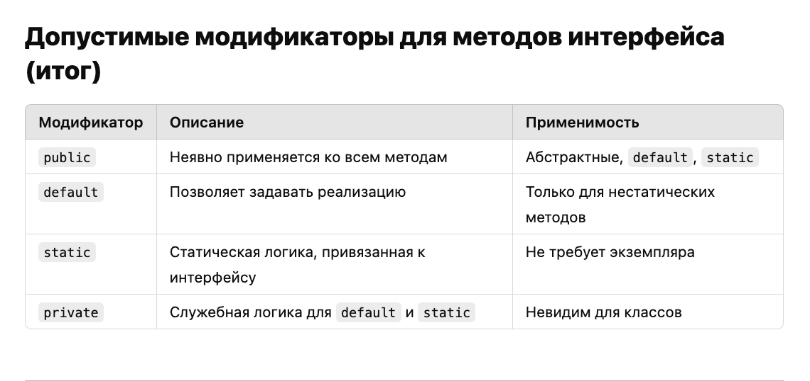

#### Не проверяемые исключения:

1. **Их нужно либо проверить**, для того что бы избежать (*более правильный вариант с точки быстродействия*)

**например**: *Проверка делителя перед делением*

`if (b != 0) { `

` int result = a / b;`

` System.out.println("Результат: " + result);`

`} else { `

` System.out.println("Ошибка: Деление на ноль.");`

`}`

1. **Обработать в блоке** `try-catch`:

`try {`

`    int result = a / b;`

`    System.out.println("Результат: " + result);`

`} catch (ArithmeticException e) {`

`    System.out.println("Ошибка: Деление на ноль.");`

`}`

**Модификатор** - **описание** - **применимость**

`public` - Неявно применяется ко всем методам - Абстрактные, **default**, **static**

`default` - Позволяет задавать реализацию - Только для нестатическихметодов

`static` - Статическая логика, привязанная кинтерфейсу - Не требует экземпляра

`private` - Служебная логика для **default** и **static** - Невидим для классов

