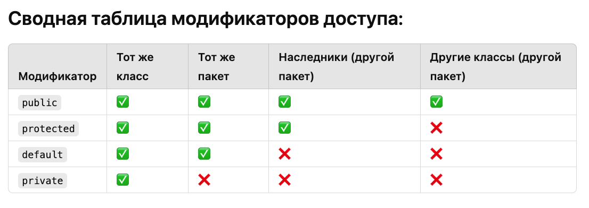

## Модификаторы доступа

В **Java** существует четыре модификатора доступа: `public`, `protected`, `default` (пакетный уровень) и `private`. Каждый из них определяет, в каких пределах доступен класс, метод или поле. Давайте подробно рассмотрим каждый модификатор, его особенности, области видимости и примеры.

:::note 

**Модификаторы доступа - \[**`public|protected|private` и `default`(по умолчанию)**\]**

:::

### **Модификаторы доступа:**



---

*  

   [image:./obektno-orientirovannoe-programmirovani-10.png::Для переменных экземпляра,  локальные переменные не имеют модификатора:0,0,100,100:92:]

*  

   [image:./obektno-orientirovannoe-programmirovani-11.png:::0,0,100,100:100:]



[comment:f90Mr]Подробнее…[/comment]



#### Рекомендации

-  **Используйте** `private` для полей и методов, чтобы скрыть детали реализации.

-  **Используйте** `protected` для того, чтобы дать доступ потомкам в иерархии классов.

-  **Используйте** `default`, если класс или метод предназначен для использования только внутри пакета.

-  **Используйте** `public`, если метод или класс должен быть доступен повсюду.

[html:iframe]

<hr/>

[/html]

### Общие правила для **переменных**

В Java **нет глобальных переменных**. Однако их функциональность можно эмулировать с помощью [comment:WtdPH]**статических переменных класса**[/comment]

В Java все переменные объявлены либо [comment:hIkBb]**внутри класса**[/comment], либо [comment:Rou5M]**внутри метода**[/comment].

[image:./obektno-orientirovannoe-programmirovani-9.png::Модификаторы доступа:0,0,100,100:68:]

Подробнее **модификаторы доступа для объектов java (3 вкладка)**

[tabs]

[tab:Конструкторы в объектах Java::]


[image:./obektno-orientirovannoe-programmirovani-5.png:::0,0,100,100:84:]

**Пояснения по конструкторам:**

1. **Обычный класс:**

   -  Конструкторы инициализируют объекты класса.

   -  Если конструктор не указан, компилятор добавляет **конструктор по умолчанию** без параметров.

      ```java
      public class Person {
          private String name;
      
          public Person(String name) {
              this.name = name;
          }
      }
      ```

2. **Абстрактный класс:**

   -  Не может создавать экземпляры, но **конструкторы могут быть вызваны в подклассах**.

      ```java
      public abstract class Animal {
          protected Animal() {
              System.out.println("Animal created");
          }
      }
      
      public class Dog extends Animal {
          public Dog() {
              super();  // Вызов конструктора абстрактного класса
              System.out.println("Dog created");
          }
      }
      ```

3. **Интерфейс:**

   -  Конструкторы не допускаются, так как интерфейсы не предназначены для создания экземпляров.

4. **Перечисления (enum):**

   -  Конструкторы в **enum** всегда `private`.

   -  Они инициализируют значения перечисления.

      ```java
      public enum Day {
          MONDAY("Mon"), TUESDAY("Tue");
      
          private String abbreviation;
      
          private Day(String abbreviation) {
              this.abbreviation = abbreviation;
          }
      }
      ```

5. **Записи (records):**

   -  В Java **records** автоматически создают **конструктор** для инициализации полей.

      ```java
      public record Point(int x, int y) {}
      ```

6. **Анонимные классы:**

   -  Не могут иметь явных конструкторов. Вся инициализация происходит внутри блока инициализации.

      ```java
      Runnable runnable = new Runnable() {
          {
              System.out.println("Anonymous class initialized");
          }
      
          @Override
          public void run() {
              System.out.println("Running");
          }
      };
      ```

7. **Вложенные классы:**

   -  Статические и нестатические (inner) классы могут иметь конструкторы.

   -  **Inner классы** имеют доступ к экземпляру внешнего класса

      ```java
      public class Outer {
          class Inner {
              public Inner() {
                  System.out.println("Inner class created");
              }
          }
      }
      ```

[image:./obektno-orientirovannoe-programmirovani-8.png:::0,0,100,100:78:]

[/tab]

[tab:Методы в разных объектах Java::]

[image:./obektno-orientirovannoe-programmirovani-6.png:::0,0,100,100:78:]

**Пояснения по методам:**

1. **Обычный класс**

   -  Поддерживает **все типы методов**: обычные, статические, финализированные и даже абстрактные (если класс сам объявлен как `abstract`).

      ```java
      public class Example {
          public void instanceMethod() {}
          public static void staticMethod() {}
      }
      ```

2. **Абстрактный класс**

   -  Может содержать **обычные** и **абстрактные методы**.

   -  **Абстрактные методы** должны быть переопределены в подклассах.

      ```java
      public abstract class Animal {
          public abstract void sound();  // Абстрактный метод
          public void sleep() {          // Обычный метод
              System.out.println("Sleeping...");
          }
      }
      ```

3. **Интерфейс**

   -  До Java 8 интерфейсы могли содержать только **абстрактные методы** (неявно `public`).

   -  С Java 8 интерфейсы могут содержать `default` и `static` методы с реализацией.

   -  С Java 9 появились `private` методы для внутреннего использования.

      ```java
      public interface Vehicle {
          void move();  // Абстрактный метод
          default void stop() { System.out.println("Stopping..."); }
          static void service() { System.out.println("Servicing..."); }
          private void log() { System.out.println("Log..."); }
      }
      ```

4. **Перечисление (enum)**

   -  Может содержать **обычные** методы.

   -  Также может содержать **абстрактные методы**, которые **обязаны быть реализованы** в константах перечисления.

      ```java
      public enum Day {
          MONDAY {
              @Override
              public void action() {
                  System.out.println("Work hard!");
              }
          },
          SUNDAY {
              @Override
              public void action() {
                  System.out.println("Rest.");
              }
          };
      
          public abstract void action();
      }
      ```

5. **Записи (record)**

   -  Методы в записях ограничены: записи автоматически создают конструкторы и геттеры для полей.

   -  Можно добавлять свои методы, но только **обычные и статические**.

      ```java
      public record Point(int x, int y) {
          public double distanceFromOrigin() {
              return Math.sqrt(x * x + y * y);
          }
      }
      ```

6. **Анонимные классы**

   -  Анонимные классы могут переопределять методы, но **не могут объявлять свои статические методы**.

      ```java
      Runnable runnable = new Runnable() {
          @Override
          public void run() {
              System.out.println("Running...");
          }
      };
      ```

7. **Вложенный (static) класс**

   -  Может содержать **обычные и статические методы**.

      ```java
      public class Outer {
          static class StaticNested {
              public void instanceMethod() {}
              public static void staticMethod() {}
          }
      }
      ```

8. **Inner класс (обычный вложенный класс)**

   -  **Inner класс** может содержать обычные методы, но **статические методы запрещены**.

   -  Он имеет доступ к полям и методам внешнего класса, включая **приватные**.

      ```java
      public class Outer {
          private int value = 42;
      
          class Inner {
              public void showValue() {
                  System.out.println("Value: " + value);  // Доступ к приват полю внеш класса
              }
          }
      }
      ```

[image:./obektno-orientirovannoe-programmirovani-7.png:::0,0,100,100:70:]

[/tab]

[tab:Таблица модификаторов доступа для обьектов java::]

[image:./obektno-orientirovannoe-programmirovani-4.png:::0,0,100,100:84:]

**Пояснения по таблице:**

1. **Класс (верхний уровень):**

   -  Только `public` и **package-private** допускаются.

   -  `private` и `protected` **запрещены**.

2. **Вложенные классы (static и inner):**

   -  Могут иметь любой модификатор: **public, protected, package-private, private**.

3. **Интерфейс:**

   -  Только `public` или **package-private**.

   -  `private` и `protected` запрещены.

4. **Поля класса:**

   -  Могут быть `public, protected, package-private, private`.

   -  `final` используется для неизменяемых полей.

5. **Методы класса:**

   -  Поддерживают все модификаторы: `public, protected, package-private, private`.

   -  `final` запрещает переопределение метода в подклассах.

6. **Абстрактные методы класса:**

   -  Не могут быть `private`, так как должны быть переопределены в наследниках.

   -  `final` не применим к абстрактным методам.

7. **Методы интерфейса:**

   -  **Абстрактные методы** неявно `public`.

   -  `default` и `static` методы также неявно `public`.

   -  `private` методы добавлены в Java 9 и служат для внутренней логики интерфейса.

8. **Конструкторы:**

   -  Могут иметь любой модификатор: `public, protected, package-private, private`.

   -  `private` конструкторы используются в паттерне Singleton.

9. **Локальные переменные:**

   -  Объявляются внутри методов или блоков, **не поддерживают модификаторы доступа**.

   -  Они могут быть `final`, если значение не должно изменяться.

10. Анонимные классы **не могут объявляться с модификаторами доступа** и **не поддерживают** `static` методы.

[/tab]

[/tabs]

### Модификаторы абстрактные классы и интерфейсы

:::lab 



---

*  

   **Особенности:** Абстрактные классы и модификаторы доступа

*  

   **Особенности:** Интерфейсы и модификаторы доступа

---

*  

   -  **Абстрактный метод** обязан быть `public`, `protected` или [comment:LED6m]package-private[/comment], чтобы наследники могли его переопределить.

   **абстрактный метод не может быть** `private`

   -  **Конструктор** абстрактного класса **может быть любым**, но чаще всего `protected` или `public`, чтобы ограничить создание экземпляров (через наследников).

      [comment:KfLSs]Подробнее…[/comment]

*  

   -  [comment:U7Nkr]**Методы**[/comment] без тела по умолчанию являются `public abstract`.

   -  **Константы** в интерфейсе всегда `public static final`.

   -  **Статические методы** и методы **по умолчанию** также публичные и имеют реализацию.

   -  **Приватные методы** в интерфейсе служат для улучшения внутренней логики интерфейса, но недоступны извне.



:::

### Мы применяем только два модификатора `public` и `private`.

:::note 

**\- Почему так?**

Модификаторы `default` и `protected` связаны с тонкостями проектирования. В большинстве случаев программист ошибается с выбором этих модификаторов и в дальнейшем изменяет существующий код. Так же модификаторы `default` и `protected` соблазняют программиста делать расширение кода за счет [comment:jOiFy]наследования[/comment] (**лучше избегать**). Этот механизм жестко связывает элементы. Далее в курсе мы увидим возникающую из этого проблему.

**Поэтому общее правило.**

1\. Для всех полей используем только модификатор **private**.

2\. Для классов и методов - **public**/**private**.

:::


### Так же есть есть другие модификаторы (`final`, `static`, `transient`, `volatile`):

### `final`: (final - значит неизменяемая)

**Переменные**, объявленные как `final`, являются постоянными (**константами**) и не могут быть изменены после [comment:RTSKW]инициализации[/comment] и должны быть инициализированы либо при объявлении, либо в конструкторе.

[image:./obektno-orientirovannoe-programmirovani-2.png:::0,0,100,100:53:]

#### **Рассмотрим где применяется** `final`**:**

#### \_\_ `final` методы:

**\-** Когда **метод** класса объявляется как **final**, это означает, что он **не может быть переопределен в подклассах.** Это делается для того, чтобы гарантировать, что поведение метода сохранится во всех подклассах и что ключевые аспекты реализации не будут изменены.

**\-** Применение **final** к методу может быть также использовано для небольшого увеличения производительности, так как это позволяет компилятору делать оптимизацию путем [comment:NLUSb]раннего связывания[/comment].

#### \_\_ `final` классы:

**\- Класс**, объявленный как **final**, **не может быть наследован**. Другими словами, нельзя создать подклассы от такого класса. Это часто делается в целях безопасности, чтобы предотвратить изменение поведения класса, или для гарантии его неизменности.

**\-** Класс `String` в Java, например, является `final`, что **предотвращает его расширение** и гарантирует, что строковые объекты останутся неизменными (**immutable**).

#### \_\_ `final` (*в переменных*):

[image:./obektno-orientirovannoe-programmirovani-3.png:::0,0,100,100:47:]

Когда ключевое слово **final** используется с переменной, это означает, что **переменная может быть инициализирована только один раз**, и её значение не может быть изменено после инициализации.

[html:iframe]

<h3 style="margin-top: 20px;"> <span style="background-color: #f4f4f4; padding: 4px; border-radius: 3px; overflow: auto; font-family: 'Courier New', Courier, monospace;">final</span> переменные класса</h3>
<table style="background-color: transparent; width: 100%; border-collapse: collapse;">
  <tr>
    <td style="border: 2px solid #ddd; padding: 8px;»><p style=«background-color: transparent; color: #333; padding: 3px 6px; border-radius: 3px; font-size: 16px; font-family: -apple-system, BlinkMacSystemFont, Roboto, Helvetica Neue, Arial, sans-serif;">
      <dir style="background-color: transparent; color: #333; padding: 3px 6px; border-radius: 3px; font-size: 15px; font-family: -apple-system, BlinkMacSystemFont, Roboto, Helvetica Neue, Arial, sans-serif;">Инициализируются при создании объекта, и каждый объект класса будет иметь свою копию <span style="background-color: #f4f4f4; padding: 4px; border-radius: 3px; overflow: auto; font-family: 'Courier New', Courier, monospace;">final</span> переменной.</dir>
    </td>
  </tr>
</table>

[/html]

[comment:04E06]\___\_ Подробнее ( **final** переменные класса) …[/comment]

:::tip 

-  [comment:hTL0w]**Обычные** **переменные экземпляра** и **статические переменные**[/comment] **получают значения по умолчанию** (например, `0` для числовых типов, `null` для объектов).

-  Но `final` переменные обязательно [comment:Oxj15]**требуют явной инициализации**[/comment], иначе компилятор сообщит об ошибке.

:::

[html:iframe]

<h3 style="margin-top: 20px;"> <span style="background-color: #f4f4f4; padding: 4px; border-radius: 3px; overflow: auto; font-family: 'Courier New', Courier, monospace;">final</span> переменные метода (локальные переменные)</h3>
<table style="background-color: transparent; width: 100%; border-collapse: collapse;">
  <tr>
    <td style="border: 2px solid #ddd; padding: 8px;»><p style=«background-color: transparent; color: #333; padding: 3px 6px; border-radius: 3px; font-size: 16px; font-family: -apple-system, BlinkMacSystemFont, Roboto, Helvetica Neue, Arial, sans-serif;">
      <dir style="background-color: transparent; color: #333; padding: 3px 6px; border-radius: 3px; font-size: 15px; font-family: -apple-system, BlinkMacSystemFont, Roboto, Helvetica Neue, Arial, sans-serif;">Должны быть инициализированы до их первого использования.</dir>
    </td>
  </tr>
</table>

[/html]

[comment:L7YmL]\___\_ Подробнее ( **final** локальные переменные) …[/comment]

[html:iframe]

<h3 style="margin-top: 20px;"> <span style="background-color: #f4f4f4; padding: 4px; border-radius: 3px; overflow: auto; font-family: 'Courier New', Courier, monospace;">final</span> &nbsp;<span style="background-color: #f4f4f4; padding: 4px; border-radius: 3px; overflow: auto; font-family: 'Courier New', Courier, monospace;">static</span> - константа класса</h3>
<table style="background-color: transparent; width: 100%; border-collapse: collapse;">
  <tr>
    <td style="border: 2px solid #ddd; padding: 8px;"><p style="background-color: transparent; color: #333; padding: 3px 6px; border-radius: 3px; font-size: 16px; font-family: -apple-system, BlinkMacSystemFont, Roboto, Helvetica Neue, Arial, sans-serif;">
      <span style="background-color: transparent; color: #333; padding: 3px 6px; border-radius: 3px; font-size: 15px; font-family: -apple-system, BlinkMacSystemFont, Roboto, Helvetica Neue, Arial, sans-serif;"><span style="background-color: #f4f4f4; padding: 4px; border-radius: 3px; overflow: auto; font-family: 'Courier New', Courier, monospace;">public static final</span> [тип] <strong> [идентификатор] </strong></span>
     <br/><br/>
     <span style="background-color: transparent; color: #333; padding: 3px 6px; border-radius: 3px; font-size: 15px; font-family: -apple-system, BlinkMacSystemFont, Roboto, Helvetica Neue, Arial, sans-serif;">Когда переменная объявлена как <span style="background-color: #f4f4f4; padding: 4px; border-radius: 3px; overflow: auto; font-family: 'Courier New', Courier, monospace;">final static</span> , это означает, что <strong> она является константой класса </strong>.</span>
      <br/>
      <ul>
        <li style="padding-left: 6px !important; font-family: Tahoma, sans-serif; font-size: 13px; color: #000; line-height: 1.5; letter-spacing: 0.5px;"><strong><span style="background-color: #f4f4f4; padding: 4px; border-radius: 3px; overflow: auto; font-family: 'Courier New', Courier, monospace;">static</span></strong> означает, что переменная принадлежит самому классу, а не экземплярам класса.</li>
        <li style="padding-left: 6px !important; font-family: Tahoma, sans-serif; font-size: 13px; color: #000; line-height: 1.5; letter-spacing: 0.5px;"><strong><span style="background-color: #f4f4f4; padding: 4px; border-radius: 3px; overflow: auto; font-family: 'Courier New', Courier, monospace;">final</span></strong> означает, что значение переменной нельзя изменить после инициализации.</li>
        <li style="padding-left: 6px !important; font-family: Tahoma, sans-serif; font-size: 13px; color: #000; line-height: 1.5; letter-spacing: 0.5px;"><strong><span style="background-color: #f4f4f4; padding: 4px; border-radius: 3px; overflow: auto; font-family: 'Courier New', Courier, monospace;">final static</span></strong> переменная инициализируется при загрузке класса и сохраняет своё значение на протяжении всего времени работы программы. Такие переменные часто объявляются как <span style="background-color: #f4f4f4; padding: 4px; border-radius: 3px; overflow: auto; font-family: 'Courier New', Courier, monospace;">public</span> и используются для определения констант.</li>
      </ul>
      
      <span style="background-color: transparent; color: #333; padding: 3px 6px; border-radius: 3px; font-size: 15px; font-family: -apple-system, BlinkMacSystemFont, Roboto, Helvetica Neue, Arial, sans-serif;">&nbsp;&nbsp; Поскольку <span style="background-color: #f4f4f4; padding: 4px; border-radius: 3px; overflow: auto; font-family: 'Courier New', Courier, monospace;">final static</span> переменные являются константами на уровне класса, они должны быть инициализированы во время объявления или в статическом блоке инициализации. Они доступны для использования даже без создания экземпляра класса.</span>
    </td>
  </tr>
</table>

[/html]

[comment:n8g3o]\___\_ Подробнее (final static - константа класса) …[/comment]

### `static` (переменная класса)

Переменные с модификатором `static` относятся к **классу**, а не к конкретным экземплярам (объектам) этого класса. Их ещё называют **статическими полями** или **переменными класса**. Рассмотрим подробнее их особенности, инициализацию, область видимости и примеры использования.

#### **Особенности** `static` переменных

1. **Общие для всех экземпляров класса**

   -  Все объекты класса используют **одно и то же статическое поле**.

   -  Изменение значения статической переменной через один объект отразится на всех других.

2. **Принадлежат классу, а не объекту**

   -  Доступ к переменной можно получить напрямую через **имя класса** или через объект.

   -  Она существует даже если нет ни одного созданного экземпляра.

3. **Инициализируются при загрузке класса**

   -  Статические переменные создаются **один раз** в момент загрузки класса (во время выполнения программы).

4. **Хранятся в области памяти метаданных (метаспейс)**

   -  Живут до тех пор, пока класс загружен JVM.


#### **Способы инициализации статических переменных**

1. **При объявлении**

2. **В статическом блоке**

3. **Через статический метод** (хотя это не типично)

Рассмотрим подробнее:

**1\. При объявлении:**

```java
public class MyClass {
	static int staticVar = 100; // Инициализация при объявлении 
}
```

**2\. В статическом блоке инициализации:**

-  Полезно, если инициализация переменной требует сложной логики.

```java
public class MyClass { 
	static int staticVar; 
		static {
		staticVar = 50 * 2; // Статический блок инициализации 
		System.out.println("Статический блок выполнен."); 
	} 
}
```