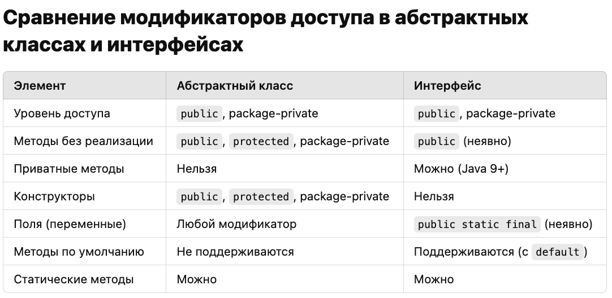

В **Java** существует четыре модификатора доступа: `public`, `protected`, `default` (пакетный уровень) и `private`. Каждый из них определяет, в каких пределах доступен класс, метод или поле. Давайте подробно рассмотрим каждый модификатор, его особенности, области видимости и примеры.

:::note 

**Модификаторы доступа - \[**`public|protected|private` и `default`(по умолчанию)**\]**

:::

### **Модификаторы доступа:**

#### **−** `public` **(публичный):**

[html:iframe]

<dir style="background-color: transparent; color: #333; padding: 3px 6px; border-radius: 3px; font-size: 13px; font-family: -apple-system, BlinkMacSystemFont, Roboto, Helvetica Neue, Arial, sans-serif;">Классы, методы, поля, конструкторы, помеченные модификатором  <span style="background-color: #f4f4f4; padding: 3px; border-radius: 3px; overflow: auto; font-family: 'Courier New', Courier, monospace;">public</span> , <strong> доступны из любого места </strong>, так и из других классов и пакетов.</dir>

[/html]

#### **−** `private` **(приватный):**

[html:iframe]

<dir style="background-color: transparent; color: #333; padding: 3px 6px; border-radius: 3px; font-size: 13px; font-family: -apple-system, BlinkMacSystemFont, Roboto, Helvetica Neue, Arial, sans-serif;">Члены класса, помеченные модификатором  <span style="background-color: #f4f4f4; padding: 3px; border-radius: 3px; overflow: auto; font-family: 'Courier New', Courier, monospace;">private</span> , <strong> видны только внутри того же класса </strong>. Они не доступны извне класса, включая подклассы.</dir>

[/html]

#### **−** `protected` **(защищенный):**

[html:iframe]

<dir style="background-color: transparent; color: #333; padding: 3px 6px; border-radius: 3px; font-size: 13px; font-family: -apple-system, BlinkMacSystemFont, Roboto, Helvetica Neue, Arial, sans-serif;"><span style="background-color: #f4f4f4; padding: 3px; border-radius: 3px; overflow: auto; font-family: 'Courier New', Courier, monospace;">protected</span> - это также модификатор доступа, что и <span style="background-color: #f4f4f4; padding: 3px; border-radius: 3px; overflow: auto; font-family: 'Courier New', Courier, monospace;">default</span>, но с более широким уровень доступа.<br/>Члены класса, помеченные модификатором <span style="background-color: #f4f4f4; padding: 3px; border-radius: 3px; overflow: auto; font-family: 'Courier New', Courier, monospace;">protected</span> , <strong> видны классе, в внутри пакета, а также в подклассах </strong>(даже если они находятся в другом пакете)</dir>

[/html]

#### **−** `default` **(по умолчанию, package-private)**

[html:iframe]

<dir style="background-color: transparent; color: #333; padding: 3px 6px; border-radius: 3px; font-size: 13px; font-family: -apple-system, BlinkMacSystemFont, Roboto, Helvetica Neue, Arial, sans-serif;">Если член класса не имеет явного модификатора доступа (т.е., не помечен как  <span style="background-color: #f4f4f4; padding: 3px; border-radius: 3px; overflow: auto; font-family: 'Courier New', Courier, monospace;">public</span> , <span style="background-color: #f4f4f4; padding: 3px; border-radius: 3px; overflow: auto; font-family: 'Courier New', Courier, monospace;">private</span> или <span style="background-color: #f4f4f4; padding: 3px; border-radius: 3px; overflow: auto; font-family: 'Courier New', Courier, monospace;">protected</span>, то он <strong> считается доступным только внутри своего собственного пакета.</strong></dir>

[/html]


#### Рекомендации

-  **Используйте** `private` для полей и методов, чтобы скрыть детали реализации.

-  **Используйте** `protected` для того, чтобы дать доступ потомкам в иерархии классов.

-  **Используйте** `default`, если класс или метод предназначен для использования только внутри пакета.

-  **Используйте** `public`, если метод или класс должен быть доступен повсюду.

[html:iframe]

<hr/>

[/html]


### 

[tabs]

[tab:Конструкторы в объектах Java::]

[image:./obektno-orientirovannoe-programmirovani-5.png:::0,0,100,100:84:]

**Пояснения по конструкторам:**

1. **Обычный класс:**

   -  Конструкторы инициализируют объекты класса.

   -  Если конструктор не указан, компилятор добавляет **конструктор по умолчанию** без параметров.

      ```java
      public class Person {
          private String name;
      
          public Person(String name) {
              this.name = name;
          }
      }
      ```

2. **Абстрактный класс:**

   -  Не может создавать экземпляры, но **конструкторы могут быть вызваны в подклассах**.

      ```java
      public abstract class Animal {
          protected Animal() {
              System.out.println("Animal created");
          }
      }
      
      public class Dog extends Animal {
          public Dog() {
              super();  // Вызов конструктора абстрактного класса
              System.out.println("Dog created");
          }
      }
      ```

3. **Интерфейс:**

   -  Конструкторы не допускаются, так как интерфейсы не предназначены для создания экземпляров.

4. **Перечисления (enum):**

   -  Конструкторы в **enum** всегда `private`.

   -  Они инициализируют значения перечисления.

      ```java
      public enum Day {
          MONDAY("Mon"), TUESDAY("Tue");
      
          private String abbreviation;
      
          private Day(String abbreviation) {
              this.abbreviation = abbreviation;
          }
      }
      ```

5. **Записи (records):**

   -  В Java **records** автоматически создают **конструктор** для инициализации полей.

      ```java
      public record Point(int x, int y) {}
      ```

6. **Анонимные классы:**

   -  Не могут иметь явных конструкторов. Вся инициализация происходит внутри блока инициализации.

      ```java
      Runnable runnable = new Runnable() {
          {
              System.out.println("Anonymous class initialized");
          }
      
          @Override
          public void run() {
              System.out.println("Running");
          }
      };
      ```

7. **Вложенные классы:**

   -  Статические и нестатические (inner) классы могут иметь конструкторы.

   -  **Inner классы** имеют доступ к экземпляру внешнего класса

      ```java
      public class Outer {
          class Inner {
              public Inner() {
                  System.out.println("Inner class created");
              }
          }
      }
      ```

[image:./obektno-orientirovannoe-programmirovani-8.png:::0,0,100,100:78:]

[/tab]

[tab:Методы в разных объектах Java::]

[image:./obektno-orientirovannoe-programmirovani-6.png:::0,0,100,100:78:]

**Пояснения по методам:**

1. **Обычный класс**

   -  Поддерживает **все типы методов**: обычные, статические, финализированные и даже абстрактные (если класс сам объявлен как `abstract`).

      ```java
      public class Example {
          public void instanceMethod() {}
          public static void staticMethod() {}
      }
      ```

2. **Абстрактный класс**

   -  Может содержать **обычные** и **абстрактные методы**.

   -  **Абстрактные методы** должны быть переопределены в подклассах.

      ```java
      public abstract class Animal {
          public abstract void sound();  // Абстрактный метод
          public void sleep() {          // Обычный метод
              System.out.println("Sleeping...");
          }
      }
      ```

3. **Интерфейс**

   -  До Java 8 интерфейсы могли содержать только **абстрактные методы** (неявно `public`).

   -  С Java 8 интерфейсы могут содержать `default` и `static` методы с реализацией.

   -  С Java 9 появились `private` методы для внутреннего использования.

      ```java
      public interface Vehicle {
          void move();  // Абстрактный метод
          default void stop() { System.out.println("Stopping..."); }
          static void service() { System.out.println("Servicing..."); }
          private void log() { System.out.println("Log..."); }
      }
      ```

4. **Перечисление (enum)**

   -  Может содержать **обычные** методы.

   -  Также может содержать **абстрактные методы**, которые **обязаны быть реализованы** в константах перечисления.

      ```java
      public enum Day {
          MONDAY {
              @Override
              public void action() {
                  System.out.println("Work hard!");
              }
          },
          SUNDAY {
              @Override
              public void action() {
                  System.out.println("Rest.");
              }
          };
      
          public abstract void action();
      }
      ```

5. **Записи (record)**

   -  Методы в записях ограничены: записи автоматически создают конструкторы и геттеры для полей.

   -  Можно добавлять свои методы, но только **обычные и статические**.

      ```java
      public record Point(int x, int y) {
          public double distanceFromOrigin() {
              return Math.sqrt(x * x + y * y);
          }
      }
      ```

6. **Анонимные классы**

   -  Анонимные классы могут переопределять методы, но **не могут объявлять свои статические методы**.

      ```java
      Runnable runnable = new Runnable() {
          @Override
          public void run() {
              System.out.println("Running...");
          }
      };
      ```

7. **Вложенный (static) класс**

   -  Может содержать **обычные и статические методы**.

      ```java
      public class Outer {
          static class StaticNested {
              public void instanceMethod() {}
              public static void staticMethod() {}
          }
      }
      ```

8. **Inner класс (обычный вложенный класс)**

   -  **Inner класс** может содержать обычные методы, но **статические методы запрещены**.

   -  Он имеет доступ к полям и методам внешнего класса, включая **приватные**.

      ```java
      public class Outer {
          private int value = 42;
      
          class Inner {
              public void showValue() {
                  System.out.println("Value: " + value);  // Доступ к приват полю внеш класса
              }
          }
      }
      ```

[image:./obektno-orientirovannoe-programmirovani-7.png:::0,0,100,100:70:]

[/tab]

[tab:Таблица модификаторов доступа для обьектов java::]

[image:./obektno-orientirovannoe-programmirovani-4.png:::0,0,100,100:84:]

**Пояснения по таблице:**

1. **Класс (верхний уровень):**

   -  Только `public` и **package-private** допускаются.

   -  `private` и `protected` запрещены.

2. **Вложенные классы (static и inner):**

   -  Могут иметь любой модификатор: **public, protected, package-private, private**.

3. **Интерфейс:**

   -  Только `public` или **package-private**.

   -  `private` и `protected` запрещены.

4. **Поля класса:**

   -  Могут быть `public, protected, package-private, private`.

   -  `final` используется для неизменяемых полей.

5. **Методы класса:**

   -  Поддерживают все модификаторы: `public, protected, package-private, private`.

   -  `final` запрещает переопределение метода в подклассах.

6. **Абстрактные методы класса:**

   -  Не могут быть `private`, так как должны быть переопределены в наследниках.

   -  `final` не применим к абстрактным методам.

7. **Методы интерфейса:**

   -  **Абстрактные методы** неявно `public`.

   -  `default` и `static` методы также неявно `public`.

   -  `private` методы добавлены в Java 9 и служат для внутренней логики интерфейса.

8. **Конструкторы:**

   -  Могут иметь любой модификатор: `public, protected, package-private, private`.

   -  `private` конструкторы используются в паттерне Singleton.

9. **Локальные переменные:**

   -  Объявляются внутри методов или блоков, **не поддерживают модификаторы доступа**.

   -  Они могут быть `final`, если значение не должно изменяться.

10. Анонимные классы **не могут объявляться с модификаторами доступа** и **не поддерживают** `static` методы.

[/tab]

[/tabs]


:::note:true Подробнее

## **Примеры и пояснения**

1. **Класс (верхний уровень):**

   -  Только `public` и package-private.

   -  Нельзя использовать `protected` или `private`.

2. **Вложенные классы:**

   -  Статические и нестатические вложенные классы могут иметь все модификаторы, включая `private`.

3. **Интерфейс:**

   -  Методы в интерфейсе могут быть:

      -  `public` по умолчанию для абстрактных методов.

      -  `default` или `static` с реализацией (с модификатором `public`).

      -  `private` для служебных методов внутри интерфейса.

4. **Поля и методы в классах:**

   -  Поддерживают все модификаторы: `public`, `protected`, package-private и `private`.

5. **Конструкторы:**

   -  Могут быть любыми: `public`, `protected`, package-private или `private`.

   -  Пример: `private` конструкторы используются для реализации шаблона Singleton.

:::

### Модификаторы абстрактные классы и интерфейсы

:::lab 





---

*  

   **Особенности:** Абстрактные классы и модификаторы доступа

*  

   **Особенности:** Интерфейсы и модификаторы доступа

---

*  

   -  **Абстрактный метод** обязан быть `public`, `protected` или [comment:LED6m]package-private[/comment], чтобы наследники могли его переопределить.

   **абстрактный метод не может быть** `private`

   -  **Конструктор** абстрактного класса **может быть любым**, но чаще всего `protected` или `public`, чтобы ограничить создание экземпляров (через наследников).

      [comment:KfLSs]Подробнее…[/comment]

*  

   -  [comment:U7Nkr]**Методы**[/comment] без тела по умолчанию являются `public abstract`.

   -  **Константы** в интерфейсе всегда `public static final`.

   -  **Статические методы** и методы **по умолчанию** также публичные и имеют реализацию.

   -  **Приватные методы** в интерфейсе служат для улучшения внутренней логики интерфейса, но недоступны извне.



:::

### Мы применяем только два модификатора `public` и `private`.

:::note 

**\- Почему так?**

Модификаторы `default` и `protected` связаны с тонкостями проектирования. В большинстве случаев программист ошибается с выбором этих модификаторов и в дальнейшем изменяет существующий код. Так же модификаторы `default` и `protected` соблазняют программиста делать расширение кода за счет [comment:jOiFy]наследования[/comment] (**лучше избегать**). Этот механизм жестко связывает элементы. Далее в курсе мы увидим возникающую из этого проблему.

**Поэтому общее правило.**

1\. Для всех полей используем только модификатор **private**.

2\. Для классов и методов - **public**/**private**.

:::

### Так же есть есть другие модификаторы (`final`, `static`, `transient`, `volatile`):

#### final: (final - значит неизменяемая)

Переменные, объявленные как `final`, являются постоянными (**константами**) и не могут быть изменены после [comment:RTSKW]инициализации[/comment].

#### **Инициализация локальных переменных**

-  Локальные переменные должны быть **явно инициализированы перед использованием**, иначе будет ошибка компиляции.

-  Компилятор **не инициализирует локальные переменные** значениями по умолчанию (в отличие от полей класса).


и должны быть инициализированы либо при объявлении, либо в конструкторе.

**На** **локальную переменную метода** это правило не распространяется. Вы можете объявить её, но не [comment:5FmDX]инициализировать[/comment] до момента ее использования.