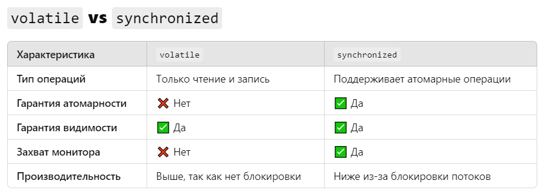

## Модификаторы доступа

В **Java** существует четыре модификатора доступа: `public`, `protected`, `default` ([comment:Idl0U]пакетный уровень[/comment]) и `private`. Каждый из них определяет, в каких пределах доступен класс, метод или поле. Давайте подробно рассмотрим каждый модификатор, его особенности, области видимости и примеры.

:::note 

**Модификаторы доступа - \[**`public|protected|private` и `default`(по умолчанию)**\]**

:::

[comment:f90Mr]Подробнее…[/comment]


**По степени ограниченности** ([comment:uXfOg]*от самого доступного модификатора*[/comment])**:**

-  `public` - **доступен отовсюду**

-  `protected` **\- доступ в рамках пакета (любые наследники)**

-  `default` **\- доступ в рамках пакета (наследники в рамках пакет)**

-  `private` **\- только тот же класс**

**Рекомендации:**

-  **Используйте** `private` для полей и методов, чтобы скрыть детали реализации.

-  **Используйте** `protected` для того, чтобы дать доступ потомкам в иерархии классов.

-  **Используйте** `default`, если класс или метод предназначен для использования только внутри пакета.

-  **Используйте** `public`, если метод или класс должен быть доступен повсюду.

[html:iframe]

<hr/>

[/html]

### Общие правила видимости для **переменных**

В Java **нет глобальных переменных**. Однако их функциональность можно эмулировать с помощью [comment:WtdPH]**статических переменных класса**[/comment]

В Java все переменные объявлены либо [comment:hIkBb]**внутри класса**[/comment], либо [comment:Rou5M]**внутри метода**[/comment].

[image:./obektno-orientirovannoe-programmirovani-9.png::Модификаторы доступа:0,0,100,100:68:]

Подробнее **модификаторы доступа для объектов java (3 вкладка)**

[tabs]

[tab:Конструкторы в объектах Java::]


[image:./obektno-orientirovannoe-programmirovani-5.png:::0,0,100,100:84:]

**Пояснения по конструкторам:**

1. **Обычный класс:**

   -  Конструкторы инициализируют объекты класса.

   -  Если конструктор не указан, компилятор добавляет **конструктор по умолчанию** без параметров.

      ```java
      public class Person {
          private String name;
      
          public Person(String name) {
              this.name = name;
          }
      }
      ```

2. **Абстрактный класс:**

   -  Не может создавать экземпляры, но **конструкторы могут быть вызваны в подклассах**.

      ```java
      public abstract class Animal {
          protected Animal() {
              System.out.println("Animal created");
          }
      }
      
      public class Dog extends Animal {
          public Dog() {
              super();  // Вызов конструктора абстрактного класса
              System.out.println("Dog created");
          }
      }
      ```

3. **Интерфейс:**

   -  Конструкторы не допускаются, так как интерфейсы не предназначены для создания экземпляров.

4. **Перечисления (enum):**

   -  Конструкторы в **enum** всегда `private`.

   -  Они инициализируют значения перечисления.

      ```java
      public enum Day {
          MONDAY("Mon"), TUESDAY("Tue");
      
          private String abbreviation;
      
          private Day(String abbreviation) {
              this.abbreviation = abbreviation;
          }
      }
      ```

5. **Записи (records):**

   -  В Java **records** автоматически создают **конструктор** для инициализации полей.

      ```java
      public record Point(int x, int y) {}
      ```

6. **Анонимные классы:**

   -  Не могут иметь явных конструкторов. Вся инициализация происходит внутри блока инициализации.

      ```java
      Runnable runnable = new Runnable() {
          {
              System.out.println("Anonymous class initialized");
          }
      
          @Override
          public void run() {
              System.out.println("Running");
          }
      };
      ```

7. **Вложенные классы:**

   -  Статические и нестатические (inner) классы могут иметь конструкторы.

   -  **Inner классы** имеют доступ к экземпляру внешнего класса

      ```java
      public class Outer {
          class Inner {
              public Inner() {
                  System.out.println("Inner class created");
              }
          }
      }
      ```

[image:./obektno-orientirovannoe-programmirovani-8.png:::0,0,100,100:78:]

[/tab]

[tab:Методы в разных объектах Java::]

[image:./obektno-orientirovannoe-programmirovani-6.png:::0,0,100,100:78:]

**Пояснения по методам:**

1. **Обычный класс**

   -  Поддерживает **все типы методов**: обычные, статические, финализированные и даже абстрактные (если класс сам объявлен как `abstract`).

      ```java
      public class Example {
          public void instanceMethod() {}
          public static void staticMethod() {}
      }
      ```

2. **Абстрактный класс**

   -  Может содержать **обычные** и **абстрактные методы**.

   -  **Абстрактные методы** должны быть переопределены в подклассах.

      ```java
      public abstract class Animal {
          public abstract void sound();  // Абстрактный метод
          public void sleep() {          // Обычный метод
              System.out.println("Sleeping...");
          }
      }
      ```

3. **Интерфейс**

   -  До Java 8 интерфейсы могли содержать только **абстрактные методы** (неявно `public`).

   -  С Java 8 интерфейсы могут содержать `default` и `static` методы с реализацией.

   -  С Java 9 появились `private` методы для внутреннего использования.

      ```java
      public interface Vehicle {
          void move();  // Абстрактный метод
          default void stop() { System.out.println("Stopping..."); }
          static void service() { System.out.println("Servicing..."); }
          private void log() { System.out.println("Log..."); }
      }
      ```

4. **Перечисление (enum)**

   -  Может содержать **обычные** методы.

   -  Также может содержать **абстрактные методы**, которые **обязаны быть реализованы** в константах перечисления.

      ```java
      public enum Day {
          MONDAY {
              @Override
              public void action() {
                  System.out.println("Work hard!");
              }
          },
          SUNDAY {
              @Override
              public void action() {
                  System.out.println("Rest.");
              }
          };
      
          public abstract void action();
      }
      ```

5. **Записи (record)**

   -  Методы в записях ограничены: записи автоматически создают конструкторы и геттеры для полей.

   -  Можно добавлять свои методы, но только **обычные и статические**.

      ```java
      public record Point(int x, int y) {
          public double distanceFromOrigin() {
              return Math.sqrt(x * x + y * y);
          }
      }
      ```

6. **Анонимные классы**

   -  Анонимные классы могут переопределять методы, но **не могут объявлять свои статические методы**.

      ```java
      Runnable runnable = new Runnable() {
          @Override
          public void run() {
              System.out.println("Running...");
          }
      };
      ```

7. **Вложенный (static) класс**

   -  Может содержать **обычные и статические методы**.

      ```java
      public class Outer {
          static class StaticNested {
              public void instanceMethod() {}
              public static void staticMethod() {}
          }
      }
      ```

8. **Inner класс (обычный вложенный класс)**

   -  **Inner класс** может содержать обычные методы, но **статические методы запрещены**.

   -  Он имеет доступ к полям и методам внешнего класса, включая **приватные**.

      ```java
      public class Outer {
          private int value = 42;
      
          class Inner {
              public void showValue() {
                  System.out.println("Value: " + value);  // Доступ к приват полю внеш класса
              }
          }
      }
      ```

[image:./obektno-orientirovannoe-programmirovani-7.png:::0,0,100,100:70:]

[/tab]

[tab:Таблица модификаторов доступа для обьектов java::]

[image:./obektno-orientirovannoe-programmirovani-4.png:::0,0,100,100:84:]

**Пояснения по таблице:**

1. **Класс (верхний уровень):**

   -  Только `public` и **package-private** допускаются.

   -  `private` и `protected` **запрещены**.

2. **Вложенные классы (static и inner):**

   -  Могут иметь любой модификатор: **public, protected, package-private, private**.

3. **Интерфейс:**

   -  Только `public` или **package-private**.

   -  `private` и `protected` запрещены.

4. **Поля класса:**

   -  Могут быть `public, protected, package-private, private`.

   -  `final` используется для неизменяемых полей.

5. **Методы класса:**

   -  Поддерживают все модификаторы: `public, protected, package-private, private`.

   -  `final` запрещает переопределение метода в подклассах.

6. **Абстрактные методы класса:**

   -  Не могут быть `private`, так как должны быть переопределены в наследниках.

   -  `final` не применим к абстрактным методам.

   -  [comment:FOpIe]**Конструктор** абстрактного класса[/comment] **может быть любым**, но чаще всего `protected` или `public`, чтобы ограничить создание экземпляров (через наследников).

7. **Методы интерфейса:**

   -  [comment:mqSno]**Методы интерфейса**[/comment] по умолчанию неявно `abstract` и `public`.

   -  **Константы** в интерфейсе всегда `public static final`.

   -  **Статические методы** (`static`) и методы **по умолчанию** (`default`) также неявно публичные( `public`) и имеют реализацию.

   -  `default` (по умолчанию) и `static` методы также неявно `public`.

   -  `private` методы добавлены в Java 9 и служат для внутренней логики интерфейса.

8. **Конструкторы:**

   -  Могут иметь любой модификатор: `public, protected, package-private, private`.

   -  `private` конструкторы используются в паттерне Singleton.

9. **Локальные переменные:**

   -  Объявляются внутри методов или блоков, **не поддерживают модификаторы доступа**.

   -  Они могут быть `final`, если значение не должно изменяться.

10. Анонимные классы **не могут объявляться с модификаторами доступа** и **не поддерживают** `static` методы.

[/tab]

[/tabs]

### Мы применяем только два модификатора `public` и `private`.

:::note 

**\- Почему так?**

Модификаторы `default` и `protected` связаны с тонкостями проектирования. В большинстве случаев программист ошибается с выбором этих модификаторов и в дальнейшем изменяет существующий код. Так же модификаторы `default` и `protected` соблазняют программиста делать расширение кода за счет [comment:jOiFy]наследования[/comment] (**лучше избегать**). Этот механизм жестко связывает элементы. Далее в курсе мы увидим возникающую из этого проблему.

**Поэтому общее правило.**

1\. Для всех полей используем только модификатор **private**.

2\. Для классов и методов - **public**/**private**.

:::

## Так же есть есть другие модификаторы (`final`, `static`, `transient`, `volatile`):

### `final`: (final - значит неизменяемая)

**Переменные**, объявленные как `final`, являются постоянными (**константами**) и не могут быть изменены после [comment:RTSKW]инициализации[/comment] и должны быть инициализированы либо при объявлении, либо в конструкторе.

[image:./obektno-orientirovannoe-programmirovani-2.png:::0,0,100,100:53:]

#### **Рассмотрим где применяется** `final`**:**

#### \_\_ `final` методы:

**\-** Когда **метод** класса объявляется как **final**, это означает, что он **не может быть переопределен в подклассах.** Это делается для того, чтобы гарантировать, что поведение метода сохранится во всех подклассах и что ключевые аспекты реализации не будут изменены.

**\-** Применение **final** к методу может быть также использовано для небольшого увеличения производительности, так как это позволяет компилятору делать оптимизацию путем [comment:NLUSb]раннего связывания[/comment].

#### \_\_ `final` классы:

**\- Класс**, объявленный как **final**, **не может быть наследован**. Другими словами, нельзя создать подклассы от такого класса. Это часто делается в целях безопасности, чтобы предотвратить изменение поведения класса, или для гарантии его неизменности.

**\-** Класс `String` в Java, например, является `final`, что **предотвращает его расширение** и гарантирует, что строковые объекты останутся неизменными (**immutable**).

#### \_\_ `final` (*в переменных*):

[image:./obektno-orientirovannoe-programmirovani-3.png:::0,0,100,100:47:]

Когда ключевое слово **final** используется с переменной, это означает, что **переменная может быть инициализирована только один раз**, и её значение не может быть изменено после инициализации.

[html:iframe]

<h3 style="margin-top: 20px;"> <span style="background-color: #f4f4f4; padding: 4px; border-radius: 3px; overflow: auto; font-family: 'Courier New', Courier, monospace;">final</span> переменные класса</h3>
<table style="background-color: transparent; width: 100%; border-collapse: collapse;">
  <tr>
    <td style="border: 2px solid #ddd; padding: 8px;»><p style=«background-color: transparent; color: #333; padding: 3px 6px; border-radius: 3px; font-size: 16px; font-family: -apple-system, BlinkMacSystemFont, Roboto, Helvetica Neue, Arial, sans-serif;">
      <dir style="background-color: transparent; color: #333; padding: 3px 6px; border-radius: 3px; font-size: 15px; font-family: -apple-system, BlinkMacSystemFont, Roboto, Helvetica Neue, Arial, sans-serif;">Инициализируются при создании объекта, и каждый объект класса будет иметь свою копию <span style="background-color: #f4f4f4; padding: 4px; border-radius: 3px; overflow: auto; font-family: 'Courier New', Courier, monospace;">final</span> переменной.</dir>
    </td>
  </tr>
</table>

[/html]

[comment:04E06]\___\_ Подробнее ( **final** переменные класса) …[/comment]

:::tip 

-  [comment:hTL0w]**Обычные** **переменные экземпляра** и **статические переменные**[/comment] **получают значения по умолчанию** (например, `0` для числовых типов, `null` для объектов).

-  Но `final` переменные обязательно [comment:Oxj15]**требуют явной инициализации**[/comment], иначе компилятор сообщит об ошибке.

:::

[html:iframe]

<h3 style="margin-top: 20px;"> <span style="background-color: #f4f4f4; padding: 4px; border-radius: 3px; overflow: auto; font-family: 'Courier New', Courier, monospace;">final</span> переменные метода (локальные переменные)</h3>
<table style="background-color: transparent; width: 100%; border-collapse: collapse;">
  <tr>
    <td style="border: 2px solid #ddd; padding: 8px;»><p style=«background-color: transparent; color: #333; padding: 3px 6px; border-radius: 3px; font-size: 16px; font-family: -apple-system, BlinkMacSystemFont, Roboto, Helvetica Neue, Arial, sans-serif;">
      <dir style="background-color: transparent; color: #333; padding: 3px 6px; border-radius: 3px; font-size: 15px; font-family: -apple-system, BlinkMacSystemFont, Roboto, Helvetica Neue, Arial, sans-serif;">Должны быть инициализированы до их первого использования.</dir>
    </td>
  </tr>
</table>

[/html]

[comment:L7YmL]\___\_ Подробнее ( **final** локальные переменные) …[/comment]

[html:iframe]

<h3 style="margin-top: 20px;"> <span style="background-color: #f4f4f4; padding: 4px; border-radius: 3px; overflow: auto; font-family: 'Courier New', Courier, monospace;">final</span> &nbsp;<span style="background-color: #f4f4f4; padding: 4px; border-radius: 3px; overflow: auto; font-family: 'Courier New', Courier, monospace;">static</span> - константа класса</h3>
<table style="background-color: transparent; width: 100%; border-collapse: collapse;">
  <tr>
    <td style="border: 2px solid #ddd; padding: 8px;"><p style="background-color: transparent; color: #333; padding: 3px 6px; border-radius: 3px; font-size: 16px; font-family: -apple-system, BlinkMacSystemFont, Roboto, Helvetica Neue, Arial, sans-serif;">
      <span style="background-color: transparent; color: #333; padding: 3px 6px; border-radius: 3px; font-size: 15px; font-family: -apple-system, BlinkMacSystemFont, Roboto, Helvetica Neue, Arial, sans-serif;"><span style="background-color: #f4f4f4; padding: 4px; border-radius: 3px; overflow: auto; font-family: 'Courier New', Courier, monospace;">public static final</span> [тип] <strong> [идентификатор] </strong></span>
     <br/><br/>
     <span style="background-color: transparent; color: #333; padding: 3px 6px; border-radius: 3px; font-size: 15px; font-family: -apple-system, BlinkMacSystemFont, Roboto, Helvetica Neue, Arial, sans-serif;">Когда переменная объявлена как <span style="background-color: #f4f4f4; padding: 4px; border-radius: 3px; overflow: auto; font-family: 'Courier New', Courier, monospace;">final static</span> , это означает, что <strong> она является константой класса </strong>.</span>
      <br/>
      <ul>
        <li style="padding-left: 6px !important; font-family: Tahoma, sans-serif; font-size: 13px; color: #000; line-height: 1.5; letter-spacing: 0.5px;"><strong><span style="background-color: #f4f4f4; padding: 4px; border-radius: 3px; overflow: auto; font-family: 'Courier New', Courier, monospace;">static</span></strong> означает, что переменная принадлежит самому классу, а не экземплярам класса.</li>
        <li style="padding-left: 6px !important; font-family: Tahoma, sans-serif; font-size: 13px; color: #000; line-height: 1.5; letter-spacing: 0.5px;"><strong><span style="background-color: #f4f4f4; padding: 4px; border-radius: 3px; overflow: auto; font-family: 'Courier New', Courier, monospace;">final</span></strong> означает, что значение переменной нельзя изменить после инициализации.</li>
        <li style="padding-left: 6px !important; font-family: Tahoma, sans-serif; font-size: 13px; color: #000; line-height: 1.5; letter-spacing: 0.5px;"><strong><span style="background-color: #f4f4f4; padding: 4px; border-radius: 3px; overflow: auto; font-family: 'Courier New', Courier, monospace;">final static</span></strong> переменная инициализируется при загрузке класса и сохраняет своё значение на протяжении всего времени работы программы. Такие переменные часто объявляются как <span style="background-color: #f4f4f4; padding: 4px; border-radius: 3px; overflow: auto; font-family: 'Courier New', Courier, monospace;">public</span> и используются для определения констант.</li>
      </ul>
      
      <span style="background-color: transparent; color: #333; padding: 3px 6px; border-radius: 3px; font-size: 15px; font-family: -apple-system, BlinkMacSystemFont, Roboto, Helvetica Neue, Arial, sans-serif;">&nbsp;&nbsp; Поскольку <span style="background-color: #f4f4f4; padding: 4px; border-radius: 3px; overflow: auto; font-family: 'Courier New', Courier, monospace;">final static</span> переменные являются константами на уровне класса, они должны быть инициализированы во время объявления или в статическом блоке инициализации. Они доступны для использования даже без создания экземпляра класса.</span>
    </td>
  </tr>
</table>

[/html]

[comment:n8g3o]\___\_ Подробнее (final static - константа класса) …[/comment]

### `static` (переменная класса)

Переменные с модификатором `static` относятся к **классу**, а не к конкретным экземплярам (объектам) этого класса. Их ещё называют **статическими полями** или **переменными класса**. Рассмотрим подробнее их особенности, инициализацию, область видимости и примеры использования.

#### **Особенности** `static` переменных

1. **Общие для всех экземпляров класса**

   -  Все объекты класса используют **одно и то же статическое поле**.

   -  Изменение значения статической переменной через один объект отразится на всех других.

2. **Принадлежат классу, а не объекту**

   -  Доступ к переменной можно получить напрямую через **имя класса** или через объект.

   -  Она существует даже если нет ни одного созданного экземпляра.

3. **Инициализируются при загрузке класса**

   -  Статические переменные создаются **один раз** в момент загрузки класса (во время выполнения программы).

4. **Хранятся в области памяти метаданных (метаспейс)**

   -  Живут до тех пор, пока класс загружен JVM.


#### **Способы инициализации статических переменных**

1. **При объявлении**

2. **В статическом блоке**

3. **Через статический метод** (хотя это не типично)

Рассмотрим подробнее:

**1\. При объявлении:**

```java
public class MyClass {
	static int staticVar = 100; // Инициализация при объявлении 
}
```

**2\. В статическом блоке инициализации:**

-  Полезно, если инициализация переменной требует сложной логики.

```java
public class MyClass { 
	static int staticVar; 
		static {
		staticVar = 50 * 2; // Статический блок инициализации 
		System.out.println("Статический блок выполнен."); 
	} 
}
```

### `static` (во вложенные классы)

`static`  - только во вложенные (*nested*) классах

Ключевое слово `static` в Java используется для обозначения классов, методов и переменных, которые принадлежат классу, а не конкретному экземпляру этого класса. Это позволяет создавать элементы, которые могут быть использованы без создания объекта этого класса.

Внешние классы могут содержать статические переменные и методы. Но сам **внешний класс не может быть** объявлен как `static`.

:::quote 

Статические вложенные классы в Java **используются для организации кода и логического группирования классов**. Они позволяют создавать классы, которые не требуют экземпляра внешнего класса для создания объекта. Это удобно, если вложенный класс связан с внешним классом, но не требует доступа к его экземпляру.

:::

*Синтаксис*:

```java
public class Outer {
    static class Inner {
        void display() {
            System.out.println("Inside static nested class");
        }
    }
}
```

*Использование*:

```java
Outer.Inner inner = new Outer.Inner();
inner.display(); // Вызов метода статического вложенного класса
```

[tabs]

[tab:Пример без статического класса::]

```java
public class Outer {
    private int outerValue = 10;

    // Нестатический внутренний класс
    class Inner {
        void display() {
            System.out.println("Outer value: " + outerValue); // Доступ к нестатической переменной внешнего класса
        }
    }
}

public class Main {
    public static void main(String[] args) {
        Outer outer = new Outer(); // Создание экземпляра внешнего класса
        Outer.Inner inner = outer.new Inner(); // Создание экземпляра внутреннего класса
        inner.display(); // Вызов метода
    }
}
```

*Объяснение*  **без статического класса**:

-  В примере с нестатическим внутренним классом `Inner`, для создания объекта внутреннего класса нужно сначала создать экземпляр внешнего класса `Outer`. Внутренний класс может обращаться к нестатическим переменным внешнего класса.

[/tab]

[tab:Пример со статическим вложенным классом::]

```java
public class Outer {
    private static int outerValue = 20; // Статическая переменная

    // Статический вложенный класс
    static class Inner {
        void display() {
            System.out.println("Outer value: " + outerValue); // Доступ к статической переменной внешнего класса
        }
    }
}

public class Main {
    public static void main(String[] args) {
        Outer.Inner inner = new Outer.Inner(); // Создание экземпляра статического вложенного класса
        inner.display(); // Вызов метода
    }
}
```

*Объяснение* **со статическим классом**:

-  В примере со статическим вложенным классом `Inner`, экземпляр внешнего класса не требуется. Статический вложенный класс может обращаться только к статическим членам внешнего класса. Это делает код более компактным и организованным.

[/tab]

[/tabs]

[html:iframe]

<h3 style="margin-top: 20px;">&nbsp;Итог ( <span style="background-color: #f4f4f4; padding: 4px; border-radius: 3px; overflow: auto; font-family: 'Courier New', Courier, monospace;">static</span>  во вложенные (nested) классах)</h3>

[/html]

Статические вложенные классы полезны для организации кода и представляют собой способ создания классов, которые логически связаны с внешним классом, но не требуют создания экземпляра этого класса. Это позволяет уменьшить потребление памяти и повысить читаемость кода.

### `static` (Статические блоки)

Статические блоки в Java **используются для инициализации статических переменных и выполнения кода**, который должен быть выполнен один раз при загрузке класса. Они выполняются, когда класс загружается в память, и перед созданием любого объекта этого класса.

#### Основные особенности статических блоков

1. **Инициализация статических переменных**:

   -  Статические блоки часто используются для инициализации статических переменных, особенно если инициализация требует более сложной логики, чем простое присваивание значения.

2. **Одноразовое выполнение**:

   -  Код внутри статического блока выполняется только один раз -- при первой загрузке класса. Это позволяет выполнять подготовку данных или конфигурацию, необходимую для работы класса.

3. **Нет необходимости в экземпляре класса**:

   -  Статические блоки могут быть выполнены без создания экземпляра класса. Это полезно для статических переменных, которые используются для хранения данных на уровне класса.

4. **Использование нескольких статических блоков**: В одном классе может быть несколько статических блоков. Они выполняются в порядке их объявления.

*Синтаксис:*

```java
public class Example {
    static int value;

    static {
        // Статический блок
        value = 10; // Инициализация статической переменной
        System.out.println("Static block executed.");
    }
}
```

#### Пример использования статических блоков

Вот пример, который демонстрирует использование статического блока для инициализации статических переменных.

```java
public class Configuration {
    static String url;
    static int port;

    static {
        // Инициализация статических переменных
        url = "http://localhost";
        port = 8080;
        System.out.println("Static block executed: URL and port initialized.");
    }

    public static void printConfiguration() {
        System.out.println("URL: " + url);
        System.out.println("Port: " + port);
    }
}

public class Main {
    public static void main(String[] args) {
        Configuration.printConfiguration(); // Вызов метода
    }
}
```

**Вывод программы:**

```yaml
Static block executed: URL and port initialized.
URL: http://localhost
Port: 8080
```

**Применения статических блоков**

1. **Инициализация сложных статических переменных**:

   -  Если инициализация статической переменной требует выполнения нескольких шагов или вычислений, статический блок позволяет сделать это эффективно.

2. **Настройка ресурсов**:

   -  Статические блоки могут быть использованы для загрузки конфигураций, установления соединений с базами данных или других ресурсов, необходимых для работы класса.

3. **Логирование и отладка**:

   -  Статические блоки могут быть полезны для логирования или отладки, когда необходимо зафиксировать события, происходящие при загрузке класса.

**Итог** `static` **(Статические блоки)**

Статические блоки в Java служат для инициализации статических переменных и выполнения кода при загрузке класса. Они позволяют удобно выполнять предварительные настройки и конфигурации, которые требуются для корректной работы класса, и делают код более организованным и читаемым.

### `ransient` в Java

`transient` -- это ключевое слово в Java, используемое для того, чтобы **исключить поле класса из процесса [comment:UqPWs]сериализации[/comment]**.

Сериализация -- это процесс преобразования объекта в поток байтов для сохранения или передачи через сеть. При сериализации объекта все его поля по умолчанию включаются в поток, но если какое-либо поле помечено как `transient`, оно **не будет сериализовано**.

#### **Когда используется** `transient`?

`transient` полезен, когда:

-  Поле содержит **временные данные**, которые не имеют смысла после восстановления объекта.

-  Поле хранит **чувствительные данные** (например, пароли), которые не должны передаваться или сохраняться.

-  Поле связано с **ресурсами**, которые не могут быть сериализованы (например, поток ввода/вывода или сокет).

:::note:true Пример использования transient

```java
Поведение transient и значения по умолчанию
Если поле помечено как transient, оно при десериализации получит значение по умолчанию:

null для ссылочных типов.
0 для примитивных числовых типов.
false для типа boolean.Поведение transient и значения по умолчанию
Если поле помечено как transient, оно при десериализации получит значение по умолчанию:

null для ссылочных типов.
0 для примитивных числовых типов.
false для типа boolean.Поведение transient и значения по умолчанию
Если поле помечено как transient, оно при десериализации получит значение по умолчанию:

null для ссылочных типов.
0 для примитивных числовых типов.
false для типа boolean.import java.io.*;

class User implements Serializable {
    private static final long serialVersionUID = 1L;  // Для сериализации
    String username;
    transient String password;  // Не будет сериализовано

    public User(String username, String password) {
        this.username = username;
        this.password = password;
    }

    @Override
    public String toString() {
        return "User{" +
                "username='" + username + '\'' +
                ", password='" + password + '\'' +
                '}';
    }
}

public class TransientExample {
    public static void main(String[] args) {
        User user = new User("Alice", "secret123");

        // Сериализация объекта
        try (ObjectOutputStream oos = new ObjectOutputStream(new FileOutputStream("user.ser"))) {
            oos.writeObject(user);
        } catch (IOException e) {
            e.printStackTrace();
        }

        // Десериализация объекта
        try (ObjectInputStream ois = new ObjectInputStream(new FileInputStream("user.ser"))) {
            User deserializedUser = (User) ois.readObject();
            System.out.println("After deserialization: " + deserializedUser);
        } catch (IOException | ClassNotFoundException e) {
            e.printStackTrace();
        }
    }
}
```

**Результат:**

```sql
After deserialization: User{username='Alice', password='null'}
```

Как видно из результата, после десериализации поле `password` стало `null`, поскольку оно было помечено как `transient`

:::

#### **Поведение** `transient` и значения по умолчанию

Если поле помечено как `transient`, оно при десериализации получит **значение по умолчанию**:

-  `null` для ссылочных типов.

-  `0` для примитивных числовых типов.

-  `false` для типа `boolean`.

#### **Особенности и ограничения** `transient`:

1. **Применим только к полям класса.**\
   Модификатор `transient` можно использовать только для полей. Его нельзя применять к методам, конструкторам или классам.

2. **Не влияет на статические поля.**\
   Статические поля принадлежат классу, а не объектам, поэтому они не участвуют в сериализации, даже если не помечены как `transient`.

3. **Объекты внутри** `transient` полей.\
   Если поле является ссылкой на объект, и оно помечено как `transient`, при сериализации эта ссылка будет проигнорирована. Но если этот объект сам по себе сериализуемый и хранится где-то ещё, его состояние всё равно можно сохранить отдельно.

:::quote 

#### **Итог (**`transient`**)**

-  `transient` исключает поле из процесса сериализации, что полезно для временных или конфиденциальных данных.

-  Поля, помеченные как `transient`, получают **значения по умолчанию** после десериализации.

-  **Статические** поля и так не сериализуются, поэтому их не нужно помечать как `transient`.

:::

### `volatile` в Java (переменные)

Модификатор `volatile` **используется ТОЛЬКО для переменных**, которые могут быть **изменены несколькими потоками**. Он гарантирует, что каждый поток будет читать **актуальное значение** переменной прямо из памяти, а не использовать локальную копию из своего кэша. Это помогает избежать проблем с **кэшированием** и **неконсистентностью данных** при работе с многопоточностью.

#### **Проблема без** `volatile`:

В Java каждый поток может **кэшировать переменные** для повышения производительности. Это означает, что изменения одной и той же переменной в одном потоке могут **не сразу** стать видны другому потоку.

[comment:lFY22]*Пример без* **volatile**[/comment]:

```java
class Example {
    private boolean running = true;

    public void stop() {
        running = false;  // Изменение значения
    }

    public void run() {
        while (running) {  // Поток может кэшировать значение и зациклиться
            // Выполняется логика
        }
    }
}
```

Если переменная `running` будет **закэширована** в одном из потоков, изменения из другого потока могут **не обновиться**, и поток может продолжать работать бесконечно.

#### Решение: использование `volatile`

[comment:tsH35]*Пример с* **volatile**[/comment]:

```java
class Example {
    private volatile boolean running = true;  // Используем volatile

    public void stop() {
        running = false;  // Изменение значения будет сразу видимо другим потокам
    }

    public void run() {
        while (running) {  // Чтение всегда будет происходить из основной памяти
            // Выполняется логика
        }
    }
}
```

Теперь каждое обращение к переменной `running` будет происходить **напрямую из памяти**, а не из кэша потока. Это гарантирует **видимость изменений** между потоками.

#### **Гарантии, которые предоставляет** `volatile`

1. **Гарантия видимости:**

   -  Когда один поток изменяет значение `volatile` переменной, другой поток всегда увидит **актуальное значение**.

2. **Запрет на оптимизации кода:**

   -  JIT-компилятор не сможет оптимизировать код таким образом, чтобы значение переменной было сохранено в локальном кэше или регистре.

3. **Частичный барьер памяти:**

   -  Запись в `volatile` переменную синхронизирует **все предыдущие изменения** других переменных с основной памятью.

#### **Ограничения** `volatile`

1. **Не гарантирует атомарность:**

   -  Если операция включает несколько действий (например, увеличение значения: `x++`), то `volatile` не гарантирует **атомарность** этой операции.

```java
class Counter {
    private volatile int count = 0;

    public void increment() {
        count++;  // Не атомарно! Может возникнуть состояние гонки (race condition)
    }
}
```

1. В этом случае следует использовать `synchronized` или атомарные классы, например, `AtomicInteger`.

2. **Подходит только для простых переменных:**

   -  `volatile` работает только с **примитивами** и ссылками на объекты. Если требуется синхронизированный доступ к сложным объектам, лучше использовать `synchronized`.



#### **Когда использовать** `volatile`?

-  Если несколько потоков читают и записывают значение переменной, и вам **не нужна атомарность операций**.

-  Для **флагов**, которые используются для контроля потока (например, `isRunning`).

-  Когда **значение переменной** должно быть **всегда актуальным** для всех потоков, но операции над ним простые (например, запись или чтение).

#### **Итог (**`volatile`)

`volatile` -- это простой способ обеспечить **согласованность данных между потоками**. Он гарантирует, что все изменения переменной будут видны сразу всем потокам. Однако он **не подходит для сложных операций**, где требуется атомарность -- в таких случаях нужно использовать `synchronized` или атомарные классы (`AtomicInteger`, `AtomicReference`).

### `synchronized` в Java (методы)

`synchronized` -- это ключевое слово в Java, используемое для **синхронизации** потоков. Оно помогает предотвратить проблемы, возникающие при одновременном доступе нескольких потоков к общим ресурсам (например, переменным или объектам), тем самым обеспечивая **безопасность потоков** и целостность данных.

:::tip 

В Java модификатор `synchronized` не может применяться непосредственно к переменным. Он **используется только для методов** или **блоков кода.**

:::

#### **Основные функции** `synchronized`

1. **Синхронизация потоков**:\
   При использовании `synchronized` в методе или блоке кода только **один поток** может его выполнять в любой момент времени. Это позволяет избежать **состояний гонки** (race conditions), когда несколько потоков одновременно изменяют одни и те же данные.

2. **Гарантия атомарности**:\
   Код внутри синхронизированного блока выполняется **атомарно**, что значит, что операции в этом коде не могут быть прерваны другими потоками, пока они не завершатся.

#### **Как используется** `synchronized`

#### **\_\_ 1. Синхронизация методов**

-  Когда метод объявляется как `synchronized`, JVM блокирует его для других потоков, пока один поток выполняет этот метод.

*Пример*:

```java
public class Counter {
    private int count = 0;

    public synchronized void increment() {
        count++;  // Этот метод может быть выполнен только одним потоком одновременно
    }

    public int getCount() {
        return count;
    }
}
```

#### \_\_ 2. Синхронизация блоков кода

-  Можно синхронизировать только определённую часть метода, а не весь метод. Это делается с помощью синхронизации по объекту.

*Пример*:

```java
public class Counter {
    private int count = 0;

    public void increment() {
        synchronized (this) {  // Синхронизация только для этого блока
            count++;
        }
    }

    public int getCount() {
        return count;
    }
}
```

#### **\_\_ 3. Синхронизация статических методов**

-  Если `synchronized` используется в статическом методе, [comment:PCNvC]блокировка происходит на уровне класса[/comment], и другие потоки не смогут получить доступ к статическим методам или полям.

*Пример*:

```java
public class Example {
    private static int sharedCount = 0;

    public static synchronized void increment() {
        sharedCount++;  // Блокировка на уровне класса
    }

    public static int getSharedCount() {
        return sharedCount;
    }
}
```

#### **Преимущества использования** `synchronized`

-  **Безопасность данных**: Обеспечивает целостность данных при работе с общими ресурсами.

-  **Легкость в использовании**: Простой и понятный способ синхронизации потоков.

---

#### **Недостатки использования** `synchronized`

-  **Снижение производительности**: Может привести к блокировке потоков и, как следствие, к потере производительности.

-  **Взаимная блокировка (deadlock)**: Если несколько потоков блокируют друг друга, это может привести к взаимной блокировке.

-  **Сложность кода**: Частое использование может сделать код менее читаемым и сложным для отладки.

#### **Итог (**`synchronized`**)**

`Synchronized` -- это механизм в Java, позволяющий управлять доступом к ресурсам, разделяемым между потоками. Он обеспечивает безопасность потоков и целостность данных, но должен использоваться осторожно из-за возможного снижения производительности и других проблем, связанных с многопоточностью.

### **Состояние гонки (Race Condition) в Java**

**Состояние гонки** -- это ошибка, которая возникает в многопоточных приложениях, когда два или более потока пытаются одновременно изменять одни и те же данные, и результат зависит от того, какой поток завершит выполнение первым. Это может привести к непредсказуемым и некорректным результатам. Давайте подробнее рассмотрим, что это такое, как это происходит, и как можно избежать состояния гонки в Java.

#### **Причины состояния гонки**

Состояние гонки возникает, когда:

-  Несколько потоков одновременно обращаются к общим ресурсам (переменным, объектам).

-  Не применяется механизмы синхронизации, такие как блокировки или другие средства управления потоками.

:::note:true Пример состояния гонки

```java
public class RaceConditionExample {
    private static int counter = 0; // Общий ресурс

    public static void main(String[] args) {
        Thread t1 = new Thread(() -> {
            for (int i = 0; i < 1000; i++) {
                counter++; // Увеличение счетчика
            }
        });

        Thread t2 = new Thread(() -> {
            for (int i = 0; i < 1000; i++) {
                counter--; // Уменьшение счетчика
            }
        });

        t1.start(); // Запуск потока 1
        t2.start(); // Запуск потока 2

        try {
            t1.join(); // Ожидание завершения потока 1
            t2.join(); // Ожидание завершения потока 2
        } catch (InterruptedException e) {
            e.printStackTrace();
        }

        System.out.println("Финальный счетчик: " + counter); // Результат
    }
}
```

### **Объяснение**

В этом примере два потока (`t1` и `t2`) одновременно увеличивают и уменьшают значение переменной `counter`. Без синхронизации результат может быть некорректным, так как потоки могут выполнять операции над переменной одновременно, что приведет к неправильному окончательному значению.

:::

#### **Как избежать состояния гонки**

#### **\_\_ 1. Синхронизация**

**Использование ключевого слова** `synchronized`

-  Блокировка позволяет одному потоку получить эксклюзивный доступ к критической секции, предотвращая доступ к ней другим потокам.

```java
public class SynchronizedExample {
    private static int counter = 0;

    public synchronized static void increment() {
        counter++;
    }

    public synchronized static void decrement() {
        counter--;
    }

    public static void main(String[] args) {
        Thread t1 = new Thread(() -> {
            for (int i = 0; i < 1000; i++) {
                increment();
            }
        });

        Thread t2 = new Thread(() -> {
            for (int i = 0; i < 1000; i++) {
                decrement();
            }
        });

        t1.start();
        t2.start();

        try {
            t1.join();
            t2.join();
        } catch (InterruptedException e) {
            e.printStackTrace();
        }

        System.out.println("Финальный счетчик: " + counter); // Теперь результат будет корректным
    }
}
```

#### **\_\_ 2. Использование** `ReentrantLock`

-  Более гибкий механизм блокировки, чем `synchronized`, позволяет управлять блокировками более подробно.

```java
import java.util.concurrent.locks.Lock;
import java.util.concurrent.locks.ReentrantLock;

public class LockExample {
    private static int counter = 0;
    private static Lock lock = new ReentrantLock();

    public static void increment() {
        lock.lock(); // Захват блокировки
        try {
            counter++;
        } finally {
            lock.unlock(); // Освобождение блокировки
        }
    }

    public static void decrement() {
        lock.lock();
        try {
            counter--;
        } finally {
            lock.unlock();
        }
    }

    public static void main(String[] args) {
        Thread t1 = new Thread(() -> {
            for (int i = 0; i < 1000; i++) {
                increment();
            }
        });

        Thread t2 = new Thread(() -> {
            for (int i = 0; i < 1000; i++) {
                decrement();
            }
        });

        t1.start();
        t2.start();

        try {
            t1.join();
            t2.join();
        } catch (InterruptedException e) {
            e.printStackTrace();
        }

        System.out.println("Финальный счетчик: " + counter); // Результат будет корректным
    }
}
```

#### **\_\_ 3. Использование** `Atomic` классов

-  Классы, такие как `AtomicInteger`, обеспечивают безопасные операции над переменными без явного использования синхронизации.

```java
import java.util.concurrent.atomic.AtomicInteger;

public class AtomicExample {
    private static AtomicInteger counter = new AtomicInteger(0);

    public static void main(String[] args) {
        Thread t1 = new Thread(() -> {
            for (int i = 0; i < 1000; i++) {
                counter.incrementAndGet(); // Безопасное увеличение
            }
        });

        Thread t2 = new Thread(() -> {
            for (int i = 0; i < 1000; i++) {
                counter.decrementAndGet(); // Безопасное уменьшение
            }
        });

        t1.start();
        t2.start();

        try {
            t1.join();
            t2.join();
        } catch (InterruptedException e) {
            e.printStackTrace();
        }

        System.out.println("Финальный счетчик: " + counter.get()); // Результат будет корректным
    }
}
```

#### **Заключение**

**Состояние гонки** -- это распространённая проблема в многопоточных приложениях, которая может привести к некорректным результатам. Для её предотвращения в Java можно использовать:

-  Синхронизацию через `synchronized`.

-  Явные блокировки с помощью `ReentrantLock`.

-  Безопасные для потоков классы, такие как `AtomicInteger`.

Использование этих методов поможет обеспечить корректность и предсказуемость работы многопоточных приложений.