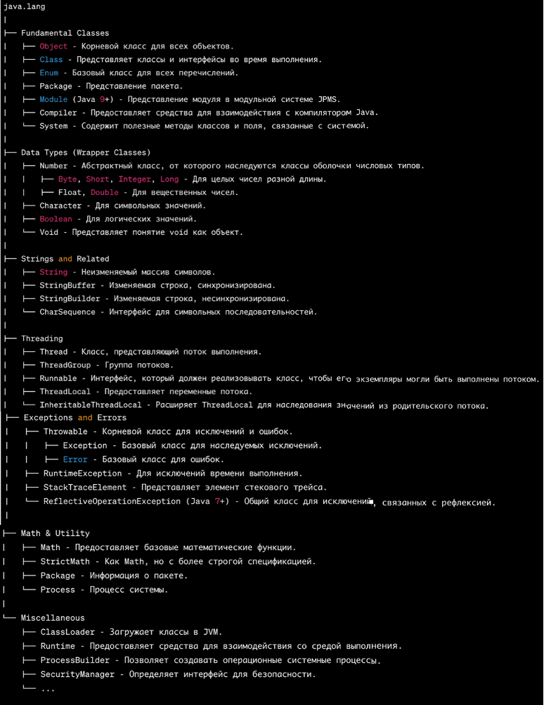
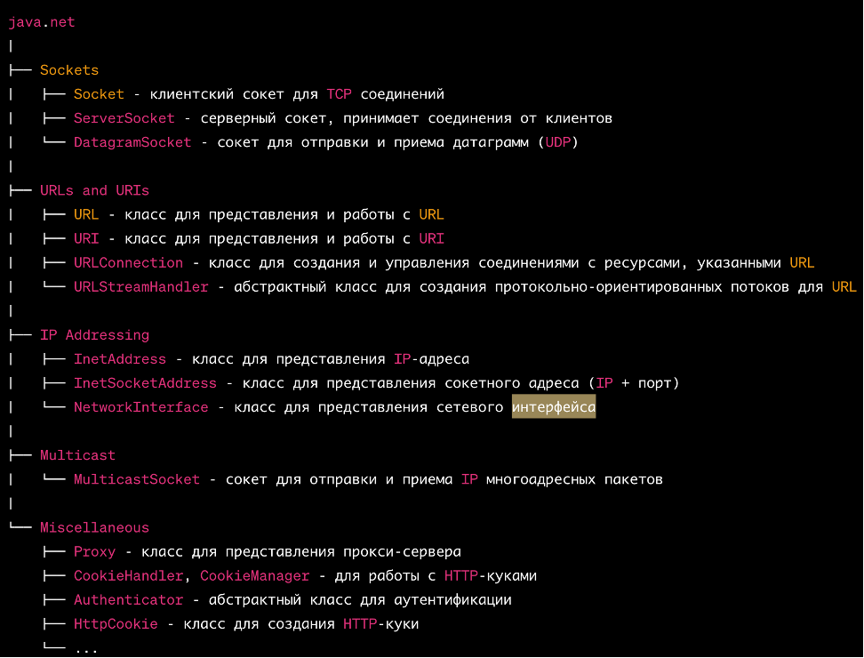

-  [1\. Ключевые концепции и синтаксис](./../_index)

-  [2\. Модификаторы доступа](./../obektno-orientirovannoe-programmirovani)

-  [3\. Типы данных и переменные](./../tipy-dannykh-i-peremennye/_index)

-  [4\. Циклы, операторы, выражения](./../3-cikly-operatory-vyrazheniya/_index)

-  [5\. Исключения](./../5-isklyucheniya)

## Основные правила синтаксиса Java

Несколько основных правил синтаксиса, которым нужно следовать при программировании на Java:

-  **В Java все находится(содержится) в классах. Класс служит шаблоном для создания объектов.**

-  Чаще всего каждый класс находится в отдельном файле с расширением `.java `(**MyFirstJavaClass.java**). Имя файла должно совпадать с именем класса. Файлы классов обычно сгруппированы в папки. Эти папки называются **пакетами**;

-  **Пакеты (Packages)** используются для организации классов в иерархическую структуру, которая упрощает управление крупными проектами. Пакеты объявляются в начале файла, например: `package com.myapp.utilities;`.

-  **Импорт классов**: Для использования классов из других пакетов, их нужно импортировать с помощью оператора `import`. Например: `import java.util.Scanner;`. Если нужно импортировать все классы из пакета, можно использовать `*`: `import java.util.*;`.

-  **Первая буква имени класса должна быть в верхнем регистре**. Если вы используете несколько слов, каждая первая буква каждого слова пишется с заглавной (например, «**M**y**F**irst**J**ava**C**lass»);

-  **Имена всех методов в синтаксисе Java начинаются со строчной буквы** (маленькой). При использовании нескольких слов последующие буквы пишутся заглавными (`public void myFirstMethodName ()`);

-  **Методы -- это** **функции, объявленные в классах**, представляет собой последовательность команд. Методы определяют поведение над объектом. Метод `main` служит точкой входа в программу: `public static void main (String [] args)`.

-  Символы чувствительны к регистру. **String не равно string**;

-  Порядок методов в файле программы не имеет значения;

-  Каждый оператор кода должен заканчиваться точкой с запятой.

-  **Ключевые слова**: В Java есть набор зарезервированных слов (например, `class`, `static`, `void`, `public` и др.), которые нельзя использовать в качестве имен переменных, методов или классов.

-  **Комментарии**: В Java есть два типа комментариев: однострочные (`//`) и многострочные (`/* */`). Также есть документирующие комментарии (`/** */`), которые используются для генерации документации (например, через Javadoc).

-  **Переменные и типы данных**: В Java переменные нужно объявлять с указанием типа данных, например: `int number = 10;`. Java поддерживает примитивные типы данных (int, char, double, boolean и т.д.) и ссылочные типы данных (объекты классов).

## Ключевые концепции Java

### 1\. Платформонезависимость

Java был разработан с целью обеспечения платформонезависимости. Благодаря Java Virtual Machine (JVM), код написанный на Java, **может выполняться на любой платформе, где установлена JVM.**

Это достигается благодаря следующим механизмам и концепциям:

**\- Байт-код Java**: когда вы компилируете программу на Java, исходный код (.java файлы) компилируется не в машинный код для конкретной платформы, а в специальный формат, называемый байт-кодом Java (**.class файлы**).

:::lab 

В Java байт-код находится в `.class` файлах.

:::


#### **Java SE (Java Standard Edition)**

**Java SE (Java Standard Edition)** -- это стандартное издание платформы Java, которое предоставляет базовую инфраструктуру для разработки и запуска Java-приложений на настольных компьютерах, серверах и аналогичных устройствах. Java SE включает в себя:

-  **Ядро Java API (Class Library)**: Базовый набор библиотек, необходимый для создания Java-приложений, включая коллекции, ввод-вывод, сетевые операции, многопоточность и многие другие.

-  **JVM (Java Virtual Machine)**: Виртуальная машина, которая интерпретирует и выполняет байт-код Java, обеспечивая платформенную независимость Java-приложений.

-  *Java Language Specification*: Документация, которая описывает формальные правила и структуры языка программирования Java.

-  **Инструменты разработки**: Набор инструментов для разработки, компиляции, отладки и мониторинга Java-приложений (частью этого набора является JDK -- Java Development Kit).

[html:iframe]

<hr/>

[/html]

### \_\_ JDK

Инструменты разработчика,  Java Development Kit (**JDK**) - представляет собой комплексное средство для разработки на языке Java. Основные компоненты и инструменты, входящие в состав JDK, включают ⇩:


### **\_\_ JRE**

**Java Runtime Environment** **(JRE)**: Это среда выполнения, в которой работают Java-приложения. Она включает в себя JVM и стандартную библиотеку классов Java. JRE доступна для многих операционных систем, включая Windows, Linux и macOS.

Это набор инструментов и библиотек, необходимых **только для запуска и выполнения Java-программ**. JRE создана для обеспечения выполнения Java-приложений на различных платформах и устройствах без необходимости повторной компиляции кода.

Стоит отметить, что **JRE** предназначена только для запуска Java-приложений. Для разработки и компиляции Java-приложений требуется **JDK** (Java Development Kit).

### **\_\_ JVM**

**Java Virtual Machine (JVM)**: это виртуальную машина, способная интерпретировать и выполнять байт-код Java. Различные операционные системы имеют свои собственные версии JVM, что позволяет Java-приложениям работать на различных платформах без изменений. Когда вы запускаете Java-приложение, JVM читает и интерпретирует байт-код для выполнения на конкретной машине.

**JVM** -- это ключевая часть Java-платформы, которая отвечает за выполнение программ, написанных на Java.

**Роль JVM**:

-  Исполнение [comment:wsrzm]байт-кода[/comment], который хранится в `.class` файлах (**результат работы компилятора**).

-  Управление памятью, включая сборку мусора ([comment:GOcqG]Garbage Collection[/comment]).

-  Управление многопоточностью и синхронизацией.

-  Предоставление среды выполнения для Java-программ.

**Компилятор** -- это инструмент, который преобразует исходный код Java (файлы с расширением `.java`) в байт-код (файлы с расширением `.class`). В экосистеме Java компилятором является программа под названием `javac`.

-  **Роль компилятора**:

   -  Преобразование исходного кода, написанного на Java, в байт-код.

   -  Проверка синтаксиса и структуры программы на этапе компиляции (ошибки времени компиляции).

   -  Оптимизация байт-кода для более эффективного выполнения на JVM.

:::note:true **Различные реализации JVM  (подробнее…)**

**JVM** (**Java Virtual Machine**) имеет множество реализаций, созданных различными компаниями и организациями для разных нужд и платформ. Вот некоторые из наиболее известных реализаций JVM:

**HotSpot**: Это самая популярная реализация JVM, созданная компанией Sun Microsystems, которая впоследствии была приобретена Oracle. Она широко используется и является стандартной JVM в OpenJDK и Oracle JDK.

**JRockit**: Это высокопроизводительная реализация JVM, первоначально разработанная компанией Appeal, затем приобретенная BEA Systems, а в конечном итоге Oracle.

**OpenJ9**: Это открытая реализация JVM, созданная IBM. Она ранее была известна как J9 и широко используется в продуктах IBM.

**GraalVM**: Это высокопроизводительная полиморфная виртуальная машина, разработанная Oracle. Она включает в себя JIT-компилятор и может выполнять приложения, написанные на многих языках, включая Java, JavaScript, Ruby и других.

**Dalvik и ART (Android Runtime)**: Dalvik -- это реализация JVM, созданная специально для Android. С версии Android 5.0 (Lollipop) Dalvik был заменен на ART.

**Azul Zing**: Это коммерческая реализация JVM, разработанная Azul Systems. Она известна своей способностью предоставлять низкую задержку и высокую пропускную способность.

**Cacao**: Это открытая реализация JVM, которая может использовать JIT-компиляцию для улучшения производительности.

**JamVM**: Это легкая реализация JVM, написанная на C, и она может быть использована вместе с GNU Classpath.

Каждая из этих реализаций JVM предоставляет свои уникальные особенности и оптимизации, но все они способны исполнять байт-код Java, что обеспечивает платформенную независимость программ на Java.

:::

#### Основные этапы работы JVM:

1. **Компиляция исходного кода (**`.java`) в байт-код (`.class`):

   -  Исходный код, написанный на Java, сохраняется в файлах с расширением `.java`.

   -  **Java-компилятор** (обычно `javac`) компилирует исходный код в промежуточный код -- **байт-код**, который сохраняется в `.class` файлах.

   -  Байт-код не зависит от конкретной платформы (Windows, Mac, Linux и т.д.), и именно его JVM будет выполнять.

      

      Этот процесс создает файл `MyProgram.class`, содержащий байт-код.

2. **Загрузка байт-кода в JVM**:

   -  JVM загружает скомпилированные `.class` файлы в память.

   -  Это делается через [comment:9nwGz]**Class Loader**[/comment] -- механизм, который управляет загрузкой классов, включая их иерархию.

3. **Проверка байт-кода (Bytecode Verification)**:

   -  Прежде чем начать выполнение байт-кода, JVM проверяет его на наличие ошибок и корректность (например, чтобы предотвратить доступ к неразрешенным областям памяти или некорректные преобразования типов).

   -  Этот шаг обеспечивает безопасность и надежность выполнения кода.

4. **Интерпретация или компиляция байт-кода (JIT-компиляция)**:

   -  На этом этапе JVM начинает интерпретацию байт-кода и его выполнение. Каждый байт-код переводится в машинные инструкции для конкретной платформы.

   -  Однако для повышения производительности JVM использует [comment:eovAn]**JIT-компилятор** (**Just-In-Time компиляция**)[/comment], который компилирует часто исполняемый байт-код в **машинный код** (специфичный для вашей платформы), во время выполнения программы, что улучшает производительность.

5. **Управление памятью и сборка мусора (Garbage Collection)**:

   -  JVM управляет памятью программы через [comment:hzzQt]**кучу (heap)**[/comment], в которой создаются объекты.

   -  Для удаления ненужных объектов, которые больше не используются, JVM запускает процесс [comment:IrjTc]**сборки мусора (Garbage Collection)**[/comment]. Это помогает освобождать память и предотвращать утечки.

6. **Выполнение программы**:

   -  После загрузки и компиляции байт-кода программа начинает выполняться.

   -  JVM управляет процессом выполнения программы, управляет потоками и синхронизацией, а также предоставляет средства обработки исключений.

7. **Завершение работы**:

   -  После завершения работы программы JVM очищает всю использованную память, закрывает потоки и завершает свое выполнение.

:::quote 

\* Дополнительно - “**Основные компоненты JVM”:**

-  **Class Loader**: загружает классы в память.

-  **Bytecode Verifier**: проверяет корректность байт-кода.

-  **Execution Engine**: интерпретирует байт-код или компилирует его с помощью JIT.

-  **Garbage Collector**: управляет памятью и удаляет неиспользуемые объекты.

#### Схема работы JVM:

1. **Компиляция (javac)** --> 2. **Байт-код (.class)** --> 3. **Class Loader** --> 4. **Bytecode Verifier** --> 5. **JIT-компиляция/интерпретация** --> 6. **Выполнение программы** --> 7. **Сборка мусора и завершение**.

:::

-  **Стандарты и спецификации:** Java имеет строгие стандарты и спецификации, определяющие, как должны работать JVM и стандартная библиотека. Это обеспечивает согласованное поведение на разных платформах.

-  [comment:Vdnuk]**Динамическая компиляция и оптимизация**[/comment]**:** Виртуальная машина Java может выполнять динамическую компиляцию и оптимизацию байт-кода в машинный код во время выполнения программы. Это позволяет адаптировать приложение к конкретной платформе и улучшить его производительность.

-  [comment:mKqAk]**Стандартная библиотека (API Java)**[/comment]**:** Java поставляется со стандартной библиотекой, которая предоставляет функции для выполнения различных задач, таких как работа с файлами, сетевое взаимодействие и графика. Благодаря этому разработчики могут использовать один и тот же код для доступа к ресурсам и сервисам, независимо от платформы. (API полунезависимо), что позволяет разработчикам использовать один и тот же код на разных платформах.

**Заключение:** Платформа независимость Java значительно упрощает разработку и развертывание программного обеспечения для разных систем. Однако стоит помнить, что, несмотря на платформа независимость языка, существуют ситуации, когда приложение может вести себя по-разному на разных системах из-за различий в реализации JVM или из-за специфичных для платформы особенностей.

:::danger 

**Современные дистрибутивы java изменились:**

1. **JDK (Java Development Kit):**

   -  Это основной пакет для разработки, который включает компилятор (`javac`), стандартные библиотеки и другие инструменты для разработки. JDK больше не имеет подкатегорий (например, SE, EE и ME), как это было раньше. Вместо этого у нас есть единый JDK для всех видов приложений.

2. **JRE (Java Runtime Environment):**

   -  С момента выхода Java 11 Oracle больше не предоставляет отдельный дистрибутив JRE. Теперь вы можете использовать **JDK для запуска Java-программ, так как он включает все необходимое для выполнения приложений.**

3. **JVM (Java Virtual Machine):**

   -  JVM остается частью JDK и используется для выполнения байт-кода Java. Она не изменилась в своих основных функциях.

**Теперь единый дистрибутив:** Начиная с Java 11, Oracle и другие дистрибьюторы, такие как OpenJDK, предлагают только один дистрибутив, который включает как инструменты для разработки (компилятор, библиотеки), так и среду выполнения (JVM).

**Отсутствует отдельный JRE:** ***С выходом Java 11 Oracle больше не предоставляет отдельного дистрибутива JRE.*** Вы можете использовать JDK для выполнения Java-программ, так как он содержит все необходимое для этого.

**OpenJDK:** Множество дистрибутивов, основанных на OpenJDK, доступны для скачивания, и они предоставляют аналогичный функционал. Выбор дистрибутива может зависеть от требований вашего проекта или предпочтений команды.

:::

### 2\. Объектно-Ориентированное Программирование (ООП)

Java является объектно-ориентированным языком программирования. Основные принципы ООП (**ознакомительно**):

:::info:true 1) Инкапсуляция: Сокрытие внутренних деталей реализации, для ограничения доступа к данным.

**Инкапсуляция** -- это процесс сокрытия внутренних деталей реализации объекта и предоставления внешнему миру доступа к этим объектам (необходимой информации) через специальные методы ([comment:h7ONz]методы доступа[/comment]). Это помогает упростить код, предотвращает нежелательное изменение состояния объекта и улучшает безопасность.

В Java инкапсуляция достигается с помощью модификаторов доступа и методов доступа **(геттеров и сеттеров**). Модификаторы доступа определяют видимость переменной или метода:

`private`: доступен только внутри класса

`default` (*отсутствие модификатора*): доступен внутри пакета

`protected`: доступен внутри пакета и для наследников класса

`public`: доступен отовсюду

В общем то, пакеты, классы, вложенные классы и методы тоже инкапсулируют код, и регулируют доступность из любой другой области программы

**Рассмотрим пример с модификатором доступа**

*Ну, вот мы защитили переменную:*

`private char ch = 102;`

*Но ее же надо как-то менять...*

Влиять на прямую небезопасно и в другой области программы (например – классе) не получится уже, так как поле “ **private** ”.

*Как менять данное поле(переменную) ?*

Для этого существуют специальные методы - так называемые **Геттеры и Сеттеры**. Ну, они не то чтобы специальные - просто настолько часто используются, что были вынесены в отдельную категорию методов.

```java
private char ch = 102;
 
public char getCh() {
    return ch;
}
public void setCh(char ch) {    
	this.ch = ch;
}
```

Сами методы `public`, а значит получить к ним доступ возможно из любой области программы. Таким образом мы сами задаем сценарий работы с данным полем (в теле метода).

:::

:::info:true 2) Наследование: Создание нового класса на основе существующего.

Одним из ключевых аспектов объектно-ориентированного программирования **является наследование**.

С помощью наследования можно расширить функционал уже имеющихся классов за счет добавления нового функционала или изменения старого.

Наследование (англ. inheritance) - это механизм, позволяющий создавать классы на основе другого класса.

Для того, чтобы унаследовать класс, нужно использовать ключевое слово **extends**:

```java
class Dog {
    void soung() { }
}
 
class Dobermann extends Dog {
	@Override // аннотация
	void soung() {
		System.out.println("Gav");
	}
}
```

## **Правила наследования**

**Правило 1. Наследуем только один класс.**

Java не поддерживает наследование нескольких классов. (нескольких можно только интерфейсов)

[html:iframe]

<mark style="background-color: transparent; color: #2F1704; font-family: 'Courier New', Courier, monospace; font-weight: bold; font-size: 18px;"> &nbsp - Один класс - один родитель.</mark><br/>
<mark style="background-color: transparent; color: #2F1704; font-family: 'Courier New', Courier, monospace; font-weight: bold; font-size: 18px;"> &nbsp - Обратите внимание - нельзя наследовать самого себя!</mark>

[/html]

**Правило 2. Наследуется все кроме приватных переменных и приватных методов.**

**Правило 3. Переопределение**

Методы **абстрактных** классов, и интерфейсов, **обязательно нужно переопределить** в классе наследнике, кроме тех что: `defolt` (имеют реализацию), **статических методов**.

Для правильного написания кода в классе наследнике перед переопределяемым методом ставится аннотация `@Override` **(см. пример выше)**

**Методы обычного класса родителя (не абстрактного)** переопределять необязательно))

**Правило 4. Вызываем методы (конструктора) родителя, через ключевое слово** `super`**. (Расширяем)**

```java
class Parent {
   void display() {
        System.out.println("Display in Parent");
    }
}
 
class Child extends Parent {
    void display() {
        super.display();  
// вызов метода display из родительского класса
        System.out.println("Display in Child");
    }
}
```

**Правило 5. Запрещаем наследование.**

Если Вы не хотите, чтобы кто-то наследовал Ваш класс, поставьте перед ним модификатор **final**.

:::

:::info:true 3) Полиморфизм: Один и тот же метод может работать разными способами в зависимости от контекста.

**Полиморфизм** в Java -- это одна из ключевых концепций объектно-ориентированного программирования (ООП), которая позволяет объектам разных классов обрабатывать методы с одинаковым именем по-разному, основываясь на их типах. Полиморфизм позволяет объекту иметь множество форм, что повышает гибкость и повторное использование кода.

(*Простыми словами*) **Полиморфизм** -- это возможность применения одноименных методов с одинаковыми или различными наборами параметров в одном классе или в группе классов, связанных отношением наследования.

## Виды полиморфизма:

### [comment:yoH19]1\. Перегрузка методов (***полиморфизм на уровне компиляции***)[/comment]



---

*  

   

*  

   Перегрузка методов(Method Over**loading**) происходит, когда в одном классе определяется два или более метода `с одинаковым именем, но с разными параметрами`.

---

*  

   

*  

   **Цель:** Целью перегрузки методов является предоставление различных вариантов вызова метода для разных типов данных или аргументов, для обработки разных ситуации с разными аргументами.



Называть методы одинаково - это очень удобно. Например, если у нас есть метод, который ищет корень квадратный из числа, гораздо легче запомнить одно название (например, `sqrt()`, чем по одному отдельному названию на этот же метод, написанный для каждого типа:

[image:./osnov_java-5.png::Пример <Перегрузки методов>:0:27:]

```yaml
Один интерфейс - много методов
```

То, что мы показывали выше - **несколько методов с одним названием и разными параметрами** - называется `перегрузкой`.

Рассмотрим `переопределение методов` - это **задание собственной реализации в классе наследника методам** которые были определены в супер классе(классе родителя).

### [comment:NhI5C]2\. Переопределение методов (***Полиморфизм на уровне выполнения***)[/comment]



---

*  

   

*  

   Переопределение метода (Method Over**riding**) происходит, когда **подкласс** предоставляет свою собственную реализацию метода, который уже определён в его **родительском классе**.

---

*  

   

*  

   Переопределённый метод в подклассе должен иметь (имя, количество и типы параметров), а так же, тип возвращаемого значения, что и метод в родительском классе. `Переопределение позволяет подклассу изменять или расширять поведение метода, унаследованного от родителя.`

---

*  

   

*  

   Когда мы наследуем какой-либо класс, мы наследуем и все его методы. Но если нам хочется изменить какой-либо из методов, который мы наследуем, мы можем всего-навсего переопределить его. А именно создать в классе наследника метод с той же сигнатурой(возвращаемым типом, с теми же аргументами и именем), задав этому методу свою реализацию



Представим, что у нас есть такая структура:

[image:./osnov_java-7.png:::0,0,100,100:90:]

Вверху иерархии классов стоит класс **Animal**. Его наследуют три класса - **Cat**, **Dog** и **Cow**.

У класса «Animal» есть метод «голос» (`voice`). Этот метод выводит на экран сообщение «Голос». Естественно, ни собака, ни кошка не говорят. Они гавкают и мяукают. Соответственно, Вам нужно задать другой метод для классов **Cat**, **Dog** и **Cow** - чтобы кошка мяукала, собака гавкала, а корова говорила «Муу».

Поэтому, в классах-наследниках мы переопределяем метод **voice()**, чтобы мы в консоли получали «Мяу», «Гав» и «Муу».

## Заключение

Полиморфизм в Java позволяет объектам разных классов реагировать на одно и то же сообщение (вызов метода) по-разному, обеспечивая гибкость и расширяемость кода. Он делится на два типа:

1. **Статический полиморфизм (компиляторный)**: достигается через **перегрузку методов**, где несколько методов имеют одинаковое имя, но разные параметры. Выбор метода происходит на этапе компиляции.

2. **Динамический полиморфизм (исполнительный)**: достигается через **переопределение методов**, где подклассы предоставляют свои реализации методов, унаследованных от суперкласса. Выбор метода происходит во время выполнения программы в зависимости от фактического типа объекта.

Таким образом, полиморфизм позволяет использовать общий интерфейс для взаимодействия с объектами различных классов, что упрощает разработку и сопровождение кода.

-  *Создать «одноименные методы» в одном классе, с разным набором параметров* - “`значит перегрузить методы`”

-  *Изменить поведение метода родительского класса, в дочернем классе* - “`значит переопределить метод`”

:::

:::info:true 4) Абстракция: Определение основных характеристик объекта, игнорируя не релевантные детали.

**Абстракция** в программировании -- это процесс **отображения только необходимых и релевантных деталей**, скрывая сложные и ненужные, предоставляя пользователю только необходимую функциональность. В Java абстракция в **основном реализуется с помощью абстрактных классов и интерфейсов**.

-  Что такое абстракция?

*Абстракция позволяет сосредоточиться на высокоуровневых операциях, игнорируя низкоуровневые детали.*

-  Как абстракция реализуется в Java?

*Абстракция в Java реализуется с помощью абстрактных классов и интерфейсов. Абстракция позволяет скрыть детали реализации и предоставить только необходимый интерфейс или сущность для работы с объектами. Рассмотрим подробнее:*

**Абстрактные классы:** Абстрактный класс в Java - это класс, который не может быть инстанциирован (т.е., создан объект этого класса), но может содержать абстрактные методы и конкретные методы. Абстрактный метод (*помечается* `abstract`) - это метод, который объявлен, но не имеет реализации в самом абстрактном классе. Дочерние классы, наследующие абстрактный класс, должны предоставить реализацию для всех абстрактных методов. *(Не поддерживает множественное наследование в отличии от интерфейсов)*

```java
public abstract class Animal {
public abstract void sound();
}

public class Dog extends Animal {
@Override
public void sound() {
   System.out.println("f");
   }
}
```

**Интерфейсы:** Интерфейс в Java - это абстрактный тип, который может содержать только [comment:4V0An]абстрактные методы[/comment] и константы (поля с ключевым словом `final` и `static`). Классы могут реализовывать интерфейсы, предоставляя реализацию для всех методов, объявленных в интерфейсе. Один класс может реализовывать несколько интерфейсов.

```java
public interface Eater {
   void eat();
}

public class Human implements Eater {
@Override
public void eat() {
System.out.print("Man eat");
   }
}
```

*(Подробнее мы разберем эти темы в след. главах, тогда станут они более понятны)*

:::

(Подробнее мы разберем эти темы в след. главах, тогда станут они более понятны)

#### Классы

Класс -- это шаблонная конструкция, которая позволяет описать в программе объект, его свойства (атрибуты или поля класса) и поведение (методы класса).

Пример класса **Dog**:

```java
public class Dog { // класс Dog
    // поля класса
    int age;
    String breed;
    String color;
 
    // метод класса
    void bark() {
        System.out.println("Woof-Woof");
    }
}
 
class Pet { 
    // класс Pet
}
```

#### Объекты

**Объект** -- это конкретный экземпляр класса. Если класс -- это чертеж, то объект -- это конкретное изделие, созданное по этому чертежу. Пример создания объекта:

```java
Dog myDog = new Dog(); // Здесь myDog — это объект (или экземпляр) класса Dog. 
```

**Атрибуты (Поля класса)**

**Поле** (или атрибуты) **класса** -- это переменная, которая представляют состояние объекта или описывает какое-либо из свойств данного класса.

```java
class Dog {
    int age;
    String breed;
    String color;
}
```

Связь между ними:

:::note 

Класс определяет структуру объекта (какие у него будут поля и методы).

**Объект** -- это конкретный экземпляр класса, созданный на основе описания класса. Он содержит реальные данные и состояние, определенные полями класса.

**Атрибуты(поля)** представляют характеристики или свойства объекта. Состояние объекта хранится в его полях. (**Переменные**)

[comment:vMWDB]***Методы***[/comment] *\- инструкции или действия с теми или иными полями(переменными), т.е. с данными*

:::

### 3\. Безопасность

Безопасность в Java реализуется на нескольких уровнях, и Java предоставляет множество инструментов и механизмов для обеспечения безопасности приложений.

#### Вот несколько основных уровней безопасности в Java:

:::info 

**В Java безопасность обычно реализуется на уровне классов и пакетов.**

:::



---

*  

   1\. **(Модификаторы) [comment:81Jq1]Уровень класса (Class-Level Security)[/comment]**: Java классы могут быть объявлены как `public`, `protected`, `private` или с **модификатором по умолчанию** (`package-private`). Эти модификаторы определяют уровень доступа к классам и их членам.

---

*  

   2\. **(модификаторы) [comment:s6AA0]Уровень метода (Method-Level Security)[/comment]**: В Java, методы могут также иметь модификаторы доступа например: public, private, protected. Эти модификаторы контролируют, какие методы могут быть вызваны извне класса.

---

*  

   3\. **(модификаторы) [comment:WTJNG]Уровень пакета (Package-Level Security)[/comment]**: Если метод или класс не имеет модификатора доступа, его доступ ограничен на уровне пакета. Только классы в том же пакете имеют доступ к нему.

   [image:./osnov_java-10.png:::0,0,100,100:52:]

---

*  

   4\. [comment:ncJcf]**Уровень приложения (Application-Level Security)**[/comment]: При разработке Java-приложений можно использовать политики безопасности для определения, какие действия разрешены для конкретного приложения. Это включает в себя настройку политик доступа к файловой системе, сети и другим ресурсам.

---

*  

   5\. [comment:FG2G6]**Уровень виртуальной машины Java (JVM-Level Security)**[/comment]: JVM обеспечивает контроль доступа к системным ресурсам, таким как файловая система и сеть. Это позволяет ограничивать действия Java-приложений и обеспечивать их изоляцию от хост-системы.

---

*  

   6\. [comment:FG3JL]**Уровень сетевой безопасности (Network Security)**[/comment]: Этот уровень фокусируется на обеспечении безопасности на уровне сетевой инфраструктуры. Это включает в себя использование протоколов безопасности, шифрование данных и аутентификацию.

---

*  

   7\. [comment:H1xLT]**Уровень приложения сети (Application-Level Network Security)**[/comment]: Java-приложения могут реализовать собственные меры безопасности для обеспечения конфиденциальности и целостности данных при обмене по сети.

   (*Это уровень безопасности, который сосредотачивается на безопасности и защите конкретных приложений, работающих поверх сети.*)

---

*  

   8\. [comment:EmL86]**Уровень безопасности приложений (Application Security)**[/comment]: Разработчики могут внедрять собственные меры безопасности в приложения, такие как аутентификация пользователей, управление сеансами и аудит действий.

---

*  

   9\. [comment:4cHMK]**Уровень системы (System-Level Security)**[/comment]: В зависимости от того, на какой операционной системе Java-приложение работает, системные политики безопасности могут быть также применены для обеспечения безопасности.

---

*  

   10\. [comment:Z5Ppx]**Уровень аудита и журналирования (Audit and Logging Security)**[/comment]: Ведение журналов и аудит действий приложения может быть важным средством для обнаружения и реагирования на потенциальные угрозы безопасности.



### 4\. Многопоточность

Java предоставляет встроенную поддержку многопоточности, что позволяет выполнять несколько задач одновременно в рамках одной программы.


#### **Основные понятия**

**Процессор** компьютера с **одним ядром** может выполнять только **одну** команду **одновременно**.

Как правило **ОС** не выделяет отдельный процессор под каждый процесс, а значит применяется процедура **time slicing** (нарезка времени) – процессор постоянно переключается между потоками выполнения. Переключение происходит сотни раз в секунду (**тактовая частота**), и со стороны кажется, что все потоки работают одновременно – но это не так.

Поток выполнения (**тред**; от англ. **thread** -- нить) -- наименьшая единица обработки, исполнение которой может быть назначено **ядром** операционной системы.

**Несколько ядер** могут решать **список** задач **параллельно**. Тогда одновременно будет выполняться более одного потока.

-  В первом случае программа называются **Однопоточной**

-  Во втором, если потоков несколько – **Многопоточной** (*это когда независимо друг от друга выполняются разные части кода*)

Основу работы с потоками в Java составляют интерфейс [**Runnable**](https://docs.oracle.com/en/java/javase/18/docs/api/java.base/java/lang/Runnable.html) и класс [**Thread**](https://docs.oracle.com/en/java/javase/18/docs/api/java.base/java/lang/Thread.html). С их помощью можно запускать и останавливать потоки выполнения, менять их свойства, среди которых основные: [**приоритет**](<https://habr.com/ru/articles/693244/#Приоритет потоков>) и [**daemon**](<https://habr.com/ru/articles/693244/#Daemon потоки>) (фоновые процессы).

**Многопоточность** -- это способность системы (или приложения) одновременно обрабатывать или выполнить несколько задач, процессов или потоков. Это достигается за счет разделения процесса на меньшие подзадачи, тем самым вместо выполнения задач по очереди одним потоком, задача делится на под процессы, и они выполняются параллельно.

:::note 

#### **Основные аспекты многопоточности:**

-  **Потоки (Threads)**: Базовые единицы многопоточности, представляющие отдельные последовательности исполнения.

-  **Синхронизация**: Механизмы, как synchronized, которые обеспечивают корректный доступ к общим ресурсам.

-  **Взаимодействие между потоками**: Методы (`wait()`, `notify()`) и инструменты для координации потоков.

-  **Пулы потоков**: Группы предварительно созданных потоков, например, `ExecutorService`.

-  **Многопоточные коллекции**: Структуры данных, такие как `ConcurrentHashMap`, предназначенные для безопасной работы в многопоточной среде.

-  **Волатильность**: Способ обеспечения видимости изменений переменной между потоками с помощью ключевого слова `volatile`.

-  **Планирование потоков**: Определяется ОС, где каждый поток получает определенное время для выполнения.

-  **ThreadLocal**: Предоставляет каждому потоку свою версию объекта, которая не доступна другим потокам.

-  **Форк/Джойн фреймворк**: Используется для рекурсивного параллелизма.

-  **Блокирующие очереди**: Коллекции, которые могут блокироваться, ожидая, когда элемент станет доступным или когда пространство освободится.

-  **Атомарные переменные**: Как `AtomicInteger`, предоставляющие `lock-free` методы для выполнения атомарных операций.

-  **Semaphores, CountDownLatch, CyclicBarrier**: Инструменты для координации действий между потоками.

-  **Phasers**: Гибкий механизм синхронизации, который объединяет возможности `CountDownLatch` и `CyclicBarrier`.

-  **Thread interruptions**: Механизм для безопасного прерывания работы потока.

:::

#### `Преимущества:`

**Эффективность**: Эффективное использование многоядерных процессоров, улучшая общую производительность приложения.

**Отклик**: Одна медленная задача не блокирует выполнение других, делая приложение более отзывчивым.

**Параллелизм**: Множество задач могут быть выполнены одновременно, ускоряя общее время выполнения.

**Ресурсоэффективность**: Позволяет оптимально использовать доступные системные ресурсы.

#### `Проблемы:`

**Состояние гонки**: Когда два или более потока пытаются одновременно обновить общий ресурс.

**Deadlocks**: Когда два или более потока взаимно блокируют друг друга, ожидая доступа к ресурсам.

**Starvation**: Когда один или несколько потоков доминируют над другими, предотвращая их выполнение.

Простой пример (*будет понятет после лямбд*):

```java
public class SimpleThreadExample { 
  public static void main(String[] args) { 
  Thread thread = new Thread(() -> { 
  System.out.println("Простой поток работает!"); 
  }); 
   
  thread.start();
  } 
}
```

*Этот пример демонстрирует создание и запуск базового потока, который просто выводит сообщение в консоль.*

### 5\. Инструменты и среды выполнения

Рассмотрим ***основные инструменты и среды***, которые чаще всего используются в Java-разработке:

**1\. Ядро разработки (Core Development Tools):**

-  **JDK (Java Development Kit)**: Основной инструмент для разработки, включает в себя компилятор (javac), архиватор (jar), документировщик (javadoc) и многие другие утилиты.

-  **JRE (Java Runtime Environment)**: Необходим для выполнения Java-приложений, содержит JVM и стандартные библиотеки классов.

-  **JVM (Java Virtual Machine)**: Виртуальная машина, на которой выполняется байт-код Java. Примеры реализаций: HotSpot, OpenJ9, GraalVM.

**2\. Интегрированные среды разработки (IDEs):**

-  **Eclipse**: Бесплатная IDE с открытым исходным кодом.

-  **IntelliJ IDEA**: Существуют Community и Ultimate версии.

-  **NetBeans**: поддерживается Apache, предлагает богатый набор функций.

**3\. Инструменты сборки и управления зависимостями:**

-  **Maven**: Централизованная система управления проектами.

-  **Gradle**: Гибкий и мощный инструмент сборки.

**4\. Профилирование и мониторинг:**

-  **VisualVM**: Мониторинг, отладка, профилирование и диагностика приложений.

-  **JProfiler**: Коммерческий профилировщик для анализа производительности.

-  **YourKit**: еще один коммерческий профилировщик, фокусируется на производительности и утечках памяти

**5\. Библиотеки и фреймворки:**

-  **Spring**: Обширный фреймворк для создания различных видов Java-приложений.

-  **Kibernate**: Фреймворк для объектно-реляционного отображения (ORM).

-  **JavaFX**: Библиотека для создания насыщенных клиентских интерфейсов.

**6\. Дополнительные инструменты:**

-  **JMH (Java Microbenchmarking Harness)**: Измерение производительности кода.

-  **GraalVM**: Расширяемая среда выполнения с поддержкой многих языков.

-  **Thread Visualizer**: Инструменты для визуализации многопоточности и конкуренции в Java-приложениях.

Java обладает обширной экосистемой, и существует множество других инструментов и библиотек для различных задач и потребностей разработчиков.

### 6\. API и библиотеки

Java предоставляет обширную стандартную библиотеку, которая содержит классы и интерфейсы для различных задач, таких как коллекции данных, работы с файлами, сетевого программирования и многое другое, рассмотрим некоторые из наиболее значимых и популярных API и библиотек в Java:

**Для того что бы посмотреть, стандартную библиотеку, с теми классами что в ней находятся, для этого нужно** (**в IntelliJ IDEA**): создать новый проект **CMD + O/control + N**

[image:./osnov_java-4.png:::0,0,100,100:69:]

#### 1\. Стандартные библиотеки Java (Java Standard Library)

-  **java.lang**: Основные классы, такие как **Object, String, Math и System.**

:::note:true Подробнее



:::

-  **java.util: Основные утилиты и коллекции. (Описание некоторых классов и интерфейсов:**)

:::note:true Подробнее


:::

-  **java.io**: Ввод-вывод: классы для работы с файлами, потоками, сериализацией и другими операциями ввода-вывода

:::note:true Подробнее


:::

-  **java.net**: Пакет java.net предоставляет классы для реализации приложений сетевого взаимодействия. Вот структура и иерархия основных компонентов этого пакета:

:::note:true Подробнее



:::

-  **java.math:** Классы для высокоточных математических операций

:::note:true Подробнее


:::

-  **java.nio:** **Пакет java.nio (New I/O)** был введен в Java 1.4 и предоставляет альтернативный способ работы с вводом-выводом, особенно с высокопроизводительным вводом-выводом.

:::note:true Подробнее


:::

-  **java.security:** Функциональность безопасности.

:::note:true Подробнее


:::

-  **java.text**: Классы для обработки, форматирования и анализа текста. Включает в себя `SimpleDateFormat` для работы с датами и `DecimalFormat` для чисел.

:::note:true Подробнее


:::

-  **java.sql:** API для работы с реляционными базами данных, включая JDBC.

:::note:true Подробнее


:::

-  **javax.xml**: API для работы с XML, включая парсинг, трансформацию и другие базовые операции с XML.

-  **java.awt**: Abstract Window Toolkit -- старая библиотека для создания графического интерфейса пользователя и рисования графики.

-  **javax.swing**: **Набор виджетов для создания графического интерфейса на базе AWT.**

:::note:true Подробнее


:::

-  **java.time:** Современный API для работы с датой и временем, введенный в Java 8, предоставляющий классы, такие как LocalDate, LocalTime и LocalDateTime.

:::note:true Подробнее


:::

#### 2\. Веб-разработка и Java EE/Jakarta EE

**Servlet API**: Основа для создания веб-приложений в Java.

**JSP (JavaServer Pages)**: Технология для создания динамических веб-страниц.

**JPA (Java Persistence API)**: API для объектно-реляционного отображения и взаимодействия с базами данных.

**JAX-RS**: API для создания RESTful веб-сервисов.

#### 3\. Фреймворки и библиотеки для веб-разработки

**Spring**: Обширный фреймворк, включая Spring MVC для веб-приложений, Spring Boot для быстрого создания приложений и Spring Data для работы с данными.

**Hibernate**: Популярная реализация JPA для взаимодействия с базами данных.

#### 4\. Графический интерфейс и мультимедиа

**JavaFX**: Современная библиотека для создания насыщенных клиентских интерфейсов.

**AWT и Swing**: Более старые библиотеки для создания графического интерфейса.

#### 5\. Многопоточность и параллелизм