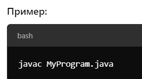

-  [1\. Ключевые концепции и синтаксис](./klyuchevye-koncepcii-i-sintaxis)

-  [2\. Модификаторы доступа](./obektno-orientirovannoe-programmirovani)

-  [3\. Типы данных и переменные](./tipy-dannykh-i-peremennye/_index)

-  [4\. Циклы, операторы, выражения](./3-cikly-operatory-vyrazheniya/_index)

-  [5\. Исключения](./5-isklyucheniya)

## Основные правила синтаксиса Java

Есть несколько основных правил синтаксиса, которым нужно следовать при программировании на Java:

-  **В Java все находится(сродержится) в классах. Класс служит шаблоном для создания объектов.**

-  Чаще всего каждый класс находится в отдельном файле с расширением `.java `(**MyFirstJavaClass.java**). Имя файла должно совпадать с именем класса. Файлы классов обычно сгруппированы в папки. Эти папки называются **пакетами**;

-  Первая буква имени класса должна быть в верхнем регистре. Если вы используете несколько слов, указывайте прописные буквы для первой буквы каждого слова (например, «**M**y**F**irst**J**ava**C**lass»);

-  **Методы -- это** **функции, объявленные в классах**, представляет собой последовательность команд. Методы определяют поведение над объектом; Главный метод `main` служит точкой входа в программу: `public static void main (String [] args)`. Метод `main()` является обязательной частью любой Java-программы;

-  **Имена всех методов в синтаксисе Java начинаются со строчной буквы** (маленькой). При использовании нескольких слов последующие буквы пишутся заглавными (public void **m**y**F**irst**M**ethod**N**ame ());

-  Символы чувствительны к регистру. **String не равно string**;

-  Порядок методов в файле программы не имеет значения;

-  Каждый оператор кода должен заканчиваться точкой с запятой.

## Ключевые концепции Java

### 1\. Платформонезависимость

Java был разработан с целью обеспечения платформонезависимости. Благодаря Java Virtual Machine (JVM), код, написанный на Java, **может выполняться на любой платформе, где установлена JVM.**

Это достигается благодаря следующим механизмам и концепциям:

**\- Байт-код Java**: когда вы компилируете программу на Java, исходный код (.java файлы) компилируется не в машинный код для конкретной платформы, а в специальный формат, называемый байт-кодом Java (**.class файлы**).


**Java SE (Java Standard Edition)** -- это стандартное издание платформы Java, которое предоставляет базовую инфраструктуру для разработки и запуска Java-приложений на настольных компьютерах, серверах и аналогичных устройствах. Java SE включает в себя:

-  **Ядро Java API**: Базовый набор библиотек, необходимый для создания Java-приложений, включая коллекции, ввод-вывод, сетевые операции, многопоточность и многие другие.

-  **JVM (Java Virtual Machine)**: Виртуальная машина, которая интерпретирует и выполняет байт-код Java, обеспечивая платформенную независимость Java-приложений.

-  **Java Language Specification**: Документация, которая описывает формальные правила и структуры языка программирования Java.

-  **Другие инструменты и утилиты**: Набор инструментов для разработки, компиляции, отладки и мониторинга Java-приложений (частью этого набора является JDK -- Java Development Kit).

[html:iframe]

<hr/>

[/html]

### \_\_ JDK

Инструменты разработчика,  Java Development Kit (**JDK**) - представляет собой комплексное средство для разработки на языке Java. Основные компоненты и инструменты, входящие в состав JDK, включают ⇩:


### **\_\_ JRE**

**Java Runtime Environment** **(JRE)**: Это среда выполнения, в которой работают Java-приложения. Она включает в себя JVM и стандартную библиотеку классов Java. JRE доступна для многих операционных систем, включая Windows, Linux и macOS.

Это набор инструментов и библиотек, необходимых для запуска и выполнения Java-программ. JRE создана для обеспечения выполнения Java-приложений на различных платформах и устройствах без необходимости повторной компиляции кода.

Стоит отметить, что **JRE** предназначена только для запуска Java-приложений. Для разработки и компиляции Java-приложений требуется **JDK** (Java Development Kit).

### **\_\_ JVM**

**Java Virtual Machine (JVM)**: это виртуальную машина, способная интерпретировать и выполнять байт-код Java. Различные операционные системы имеют свои собственные версии JVM, что позволяет Java-приложениям работать на различных платформах без изменений. Когда вы запускаете Java-приложение, JVM читает и интерпретирует байт-код для выполнения на конкретной машине.

**JVM** -- это ключевая часть Java-платформы, которая отвечает за выполнение программ, написанных на Java. Работу JVM можно разделить на несколько этапов: от компиляции исходного кода до выполнения программы.

:::note:true **Реализации JVM  (подробнее…)**

**JVM** (**Java Virtual Machine**) имеет множество реализаций, созданных различными компаниями и организациями для разных нужд и платформ. Вот некоторые из наиболее известных реализаций JVM:


**HotSpot**: Это самая популярная реализация JVM, созданная компанией Sun Microsystems, которая впоследствии была приобретена Oracle. Она широко используется и является стандартной JVM в OpenJDK и Oracle JDK.

**JRockit**: Это высокопроизводительная реализация JVM, первоначально разработанная компанией Appeal, затем приобретенная BEA Systems, а в конечном итоге Oracle.

**OpenJ9**: Это открытая реализация JVM, созданная IBM. Она ранее была известна как J9 и широко используется в продуктах IBM.

**GraalVM**: Это высокопроизводительная полиморфная виртуальная машина, разработанная Oracle. Она включает в себя JIT-компилятор и может выполнять приложения, написанные на многих языках, включая Java, JavaScript, Ruby и других.

**Dalvik и ART (Android Runtime)**: Dalvik -- это реализация JVM, созданная специально для Android. С версии Android 5.0 (Lollipop) Dalvik был заменен на ART.

**Azul Zing**: Это коммерческая реализация JVM, разработанная Azul Systems. Она известна своей способностью предоставлять низкую задержку и высокую пропускную способность.

**Cacao**: Это открытая реализация JVM, которая может использовать JIT-компиляцию для улучшения производительности.

**JamVM**: Это легкая реализация JVM, написанная на C, и она может быть использована вместе с GNU Classpath.


Каждая из этих реализаций JVM предоставляет свои уникальные особенности и оптимизации, но все они способны исполнять байт-код Java, что обеспечивает платформенную независимость программ на Java.

:::

#### Основные этапы работы JVM:

1. **Компиляция исходного кода (**`.java`) в байт-код (`.class`):

   -  Исходный код, написанный на Java, сохраняется в файлах с расширением `.java`.

   -  **Java-компилятор** (обычно `javac`) компилирует исходный код в промежуточный код -- **байт-код**, который сохраняется в `.class` файлах.

   -  Байт-код не зависит от конкретной платформы (Windows, Mac, Linux и т.д.), и именно его JVM будет выполнять.

      

      Этот процесс создает файл `MyProgram.class`, содержащий байт-код.

2. **Загрузка байт-кода в JVM**:

   -  JVM загружает скомпилированные `.class` файлы в память.

   -  Это делается через [comment:9nwGz]**Class Loader**[/comment] -- механизм, который управляет загрузкой классов, включая их иерархию.

3. **Проверка байт-кода (Bytecode Verification)**:

   -  Прежде чем начать выполнение байт-кода, JVM проверяет его на наличие ошибок и корректность (например, чтобы предотвратить доступ к неразрешенным областям памяти или некорректные преобразования типов).

   -  Этот шаг обеспечивает безопасность и надежность выполнения кода.

4. **Интерпретация или компиляция байт-кода (JIT-компиляция)**:

   -  На этом этапе JVM начинает интерпретацию байт-кода и его выполнение. Каждый байт-код переводится в машинные инструкции для конкретной платформы.

   -  Однако для повышения производительности JVM использует **JIT-компилятор** (**Just-In-Time компиляция**), который компилирует часто исполняемый байт-код в **машинный код** (специфичный для вашей платформы), во время выполнения программы, что улучшает производительность.

5. **Управление памятью и сборка мусора (Garbage Collection)**:

   -  JVM управляет памятью программы через **кучу (heap)**, в которой создаются объекты.

   -  Для удаления ненужных объектов, которые больше не используются, JVM запускает процесс **сборки мусора (Garbage Collection)**. Это помогает освобождать память и предотвращать утечки.

6. **Выполнение программы**:

   -  После загрузки и компиляции байт-кода программа начинает выполняться.

   -  JVM управляет процессом выполнения программы, управляет потоками и синхронизацией, а также предоставляет средства обработки исключений.

7. **Завершение работы**:

   -  После завершения работы программы JVM очищает всю использованную память, закрывает потоки и завершает свое выполнение.

#### Основные компоненты JVM:

-  **Class Loader**: загружает классы в память.

-  **Bytecode Verifier**: проверяет корректность байт-кода.

-  **Execution Engine**: интерпретирует байт-код или компилирует его с помощью JIT.

-  **Garbage Collector**: управляет памятью и удаляет неиспользуемые объекты.

#### Схема работы JVM:

1. **Компиляция (javac)** --> 2. **Байт-код (.class)** --> 3. **Class Loader** --> 4. **Bytecode Verifier** --> 5. **JIT-компиляция/интерпретация** --> 6. **Выполнение программы** --> 7. **Сборка мусора и завершение**.


-  [comment:Kn4q2]**Стандарты и спецификации**[/comment]**:** Java имеет строгие стандарты и спецификации, определяющие, как должны работать JVM и стандартная библиотека. Это обеспечивает согласованное поведение на разных платформах.

-  [comment:Vdnuk]**Динамическая компиляция и оптимизация**[/comment]**:** Виртуальная машина Java может выполнять динамическую компиляцию и оптимизацию байт-кода в машинный код во время выполнения программы. Это позволяет адаптировать приложение к конкретной платформе и улучшить его производительность.

-  [comment:mKqAk]**Стандартная библиотека (API Java)**[/comment]**:** Java поставляется со стандартной библиотекой, которая предоставляет функции для выполнения различных задач, таких как работа с файлами, сетевое взаимодействие и графика. Благодаря этому разработчики могут использовать один и тот же код для доступа к ресурсам и сервисам, независимо от платформы. (API полунезависимо), что позволяет разработчикам использовать один и тот же код на разных платформах.

**Заключение:** Платформа независимость Java значительно упрощает разработку и развертывание программного обеспечения для разных систем. Однако стоит помнить, что, несмотря на платформа независимость языка, существуют ситуации, когда приложение может вести себя по-разному на разных системах из-за различий в реализации JVM или из-за специфичных для платформы особенностей.

### 2\. Объектно-Ориентированное Программирование (ООП)

Java является объектно-ориентированным языком программирования. Основные принципы ООП:

:::info:true 1) Инкапсуляция: Сокрытие внутренних деталей реализации.

**Инкапсуляция** -- это процесс сокрытия внутренних деталей реализации объекта и предоставления внешнему миру только необходимых методов для взаимодействия с объектом. Это помогает упростить код, предотвращает нежелательное изменение состояния объекта и улучшает безопасность.

В Java инкапсуляция достигается с помощью модификаторов доступа и методов доступа **(геттеров и сеттеров**). Модификаторы доступа определяют видимость переменной или метода:

`private`: доступен только внутри класса

`default` (*отсутствие модификатора*): доступен внутри пакета

`protected`: доступен внутри пакета и для наследников класса

`public`: доступен отовсюду

В общем то, пакеты классы, вложенные классы и методы тоже инкапсулируют код, и регулируют доступность из любой другой области программы

Таким образом в ООП инкапсуляция – это неотъемлемая сущность


**Рассмотрим пример с модификатором доступа**

Ну, вот мы защитили переменную:

`private char ch = 102;`

Но ее же надо как-то менять...

Влиять на прямую небезопасно и в другой области программы (например – классе) не получится уже, так как поле “ **private** ”.

Как менять данное поле(переменную) ?

⁠

Для этого существуют специальные методы - так называемые Геттеры и Сеттеры. Ну, они не то чтобы специальные - просто настолько часто используются, что были вынесены в отдельную категорию методов.

```java
private char ch = 102; 
public char getCh() {
    return ch;
}
public void setCh(char ch) {    
	this.ch = ch;
}
```

Сами методы `public`, а значит получить к ним доступ возможно из любой области программы. Таким образом мы сами задаем сценарий работы с данным полем.

:::

:::info:true 2) Наследование: Создание нового класса на основе существующего.

Одним из ключевых аспектов объектно-ориентированного программирования **является наследование**.

С помощью наследования можно расширить функционал уже имеющихся классов за счет добавления нового функционала или изменения старого.

Наследование (англ. inheritance) - это механизм, позволяющий создавать классы на основе другого класса.

Для того, чтобы унаследовать класс, нужно использовать ключевое слово **extends**:

```java
class Dog {
    void soung() { }
}
 
class Dobermann extends Dog {
	@Override // аннотация
	void soung() {
		System.out.println("Gav");
	}
}
```

## **Правила наследования**

⁠

**Правило 1. Наследуем только один класс.**

Java не поддерживает наследование нескольких классов. (нескольких можно только интерфейсов)

[html:iframe]

<mark style="background-color: transparent; color: #2F1704; font-family: 'Courier New', Courier, monospace; font-weight: bold; font-size: 18px;"> &nbsp - Один класс - один родитель.</mark><br/>
<mark style="background-color: transparent; color: #2F1704; font-family: 'Courier New', Courier, monospace; font-weight: bold; font-size: 18px;"> &nbsp - Обратите внимание - нельзя наследовать самого себя!</mark>

[/html]

**Правило 2. Наследуется все кроме приватных переменных и приватных методов.**

**Правило 3. Переопределение**

Методы абстрактных классов, и интерфейсов, **обязательно нужно переопределить** в классе наследнике, кроме тех что `defolt` (имеют реализацию)

Для этого в классе наследнике перед переопределяемым методом ставится аннотация `@Override`:

**(см. пример выше)**

**Методы обычного класса родителя (не абстрактного)** можно как переопределять так и не переопределять

**Правило 4. Вызываем методы (конструктора) родителя, через ключевое слово** `super`**. (Расширяем)**

```java
class Parent {
   void display() {
        System.out.println("Display in Parent");
    }
}
 
class Child extends Parent {
    void display() {
        super.display();  
// вызов метода display из родительского класса
        System.out.println("Display in Child");
    }
}
```

**Правило 5. Запрещаем наследование.**

Если Вы не хотите, чтобы кто-то наследовал Ваш класс, поставьте перед ним модификатор **final**.

:::

:::info:true 3) Полиморфизм: Одна и та же функция или метод может работать разными способами в зависимости от контекста.

#### ***Полиморфизм -** в простых словах означает, что одно и то же имя (например, метода) может иметь разные формы поведения в зависимости от контекста. Это позволяет объектам разных типов совершать схожие действия, даже если они работают по-разному. Полиморфизм делает код более гибким и позволяет использовать общие интерфейсы для работы с различными объектами.*

ИЛИ **Полиморфизм** -- это возможность применения одноименных методов с одинаковыми или различными наборами параметров в одном классе или в группе классов, связанных отношением наследования.

[html:iframe]


<mark style="background-color: #f4f4f4; padding: 6px; border-radius: 3px; font-family: 'Courier New', Courier, monospace; line-height: 1.8; margin: 10px 0; overflow: auto;"> В Java, полиморфизм реализуется с помощью наследования/имплементирования классов и интерфейсов,<strong> а именно с помощью переопределения и перегрузки.</strong>
</mark>

[/html]

Называть методы одинаково - это очень удобно. Например, если у нас есть метод, который ищет корень квадратный из числа, гораздо легче запомнить одно название (например, **sqrt()**), чем по одному отдельному названию на этот же метод, написанный для каждого типа:

[image:./osnov_java-5.png:::0,0,100,100:39:]

Теперь Вы можете понять, почему часто этот принцип описывают фразой:

Один интерфейс - много методов


## **Перегрузка методов**

То, что мы показывали выше - несколько методов с одним названием и разными параметрами - называется **перегрузкой**. Но это был пример перегрузки метода **в одном классе**. Но бывает еще один случай - переопределение методов **родительского класса**.


Разберем:

**Перегрузка методов** (method overloading) и **переопределение методов** (method overriding) -- это два важных понятия в объектно-ориентированном программировании


**Перегрузка методов (Method Overloading):**

Перегрузка методов происходит, когда в одном классе определяется два или более метода с одинаковым именем, но с разными параметрами.

**Цель:** Целью перегрузки методов является предоставление различных вариантов вызова метода для разных типов данных или аргументов. Это удобно, чтобы обрабатывать разные ситуации с разными аргументами.

**Связывание (Binding) Перегрузка методов**

Связывание метода происходит на этапе компиляции, что называется **статическим связыванием** (static binding). Компилятор определяет, какой метод вызывать, на основе типов аргументов во время компиляции.***Пример (перегрузки метода)):***


[image:./osnov_java-6.png:::0,0,100,100:38:]

**Переопределение методов** (method overriding) в Java - это механизм, который позволяет подклассу (наследующему классу) предоставить собственную реализацию метода, который уже был определен в его суперклассе (родительском классе).


**Переопределение методов (Method Overriding):**

-  Процесс предоставления новой реализации метода в подклассе (*дочернем классе*), который уже был унаследован от суперкласса (*родительского класса*). Переопределенный метод в дочернем классе имеет тот же **прототип** *(имя, аргументы и тип возвращаемого значения*) как метод из суперкласса.

-  **Цель:** Целью переопределения методов является изменение или расширение поведения унаследованных методов, чтобы они подходили для конкретных требований дочернего класса. Таким образом, дочерний класс может предоставить свою собственную реализацию метода, определенного в родительском классе.

**Связывание (Binding) Переопределение методов**

Связывание метода происходит **на этапе выполнения программы,** что называется динамическим связыванием (dynamic binding). Во время выполнения выбирается правильная версия метода в зависимости от типа объекта.


***Пример (переопределения метода)):***

## **Переопределение методов родителя**

Выше мы уже встречали, в правилах наследования


Когда мы наследуем какой-либо класс, мы наследуем и все его методы. Но если нам хочется изменить какой-либо из методов, который мы наследуем, мы можем всего-навсего переопределить его. Мы не обязаны, например, создавать отдельный метод с похожим названием для наших нужд, а унаследованный метод будет «мертвым грузом» лежать в нашем классе.

Именно то, что мы можем создать в классе-наследнике класс с таким же названием, как и класс, который мы унаследовали от родителя, и называется переопределением.

**Пример**

Представим, что у нас есть такая структура:

[image:./osnov_java-7.png:::0,0,100,100:90:]

Вверху иерархии классов стоит класс **Animal**. Его наследуют три класса - **Cat**, **Dog** и **Cow**.

У класса «Animal» есть метод «голос» (voice). Этот метод выводит на экран сообщение "Голос". Естественно, ни собака, ни кошка не говорят. Они гавкают и мяукают. Соответственно, Вам нужно задать другой метод для классов **Cat**, **Dog** и **Cow** - чтобы кошка мяукала, собака гавкала, а корова говорила "Муу".

Поэтому, в классах-наследниках мы переопределяем метод **voice()**, чтобы мы в консоли получали "Мяу", "Гав" и "Муу".


## **Так что же такое полиморфизм**

Все примеры что выше это только способы реализации приципа полиморфизм

Давайте снова посмотрим на определение, которое мы давали в начале статьи:

**Полиморфизм** - возможность применения одноименных методов с одинаковыми или различными наборами параметров в одном классе или в группе классов, связанных отношением наследования.

Выглядит понятнее, правда? Мы показали, как можно:

-  создавать "одноименные методы" в одном классе ("перегрузка методов")

или изменить поведение методов родительского класса ("переопределение методов").

⁠

Все это - проявления «повышенной гибкости» объектно-ориентированных языков благодаря полиморфизму.

:::

• **Абстракция**: Определение основных характеристик объекта, игнорируя не релевантные детали.

(Подробнее мы разберем эти темы в след. главах, тогда станут они более понятны)


