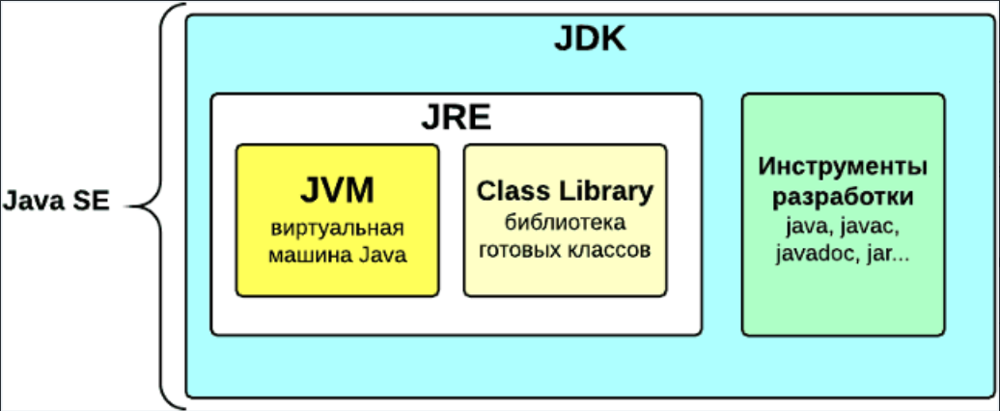
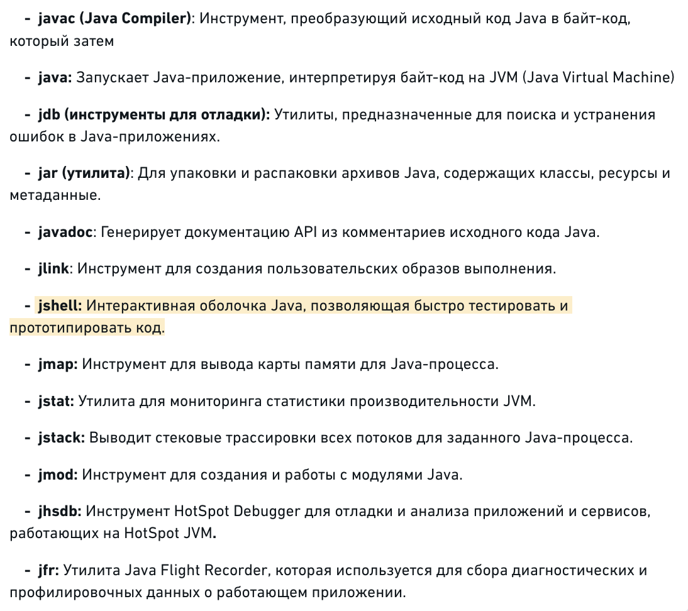

-  [1\. Ключевые концепции и синтаксис](./klyuchevye-koncepcii-i-sintaxis)

-  [2\. Модификаторы доступа](./obektno-orientirovannoe-programmirovani)

-  [3\. Типы данных и переменные](./tipy-dannykh-i-peremennye/_index)

-  [4\. Циклы, операторы, выражения](./3-cikly-operatory-vyrazheniya/_index)

-  [5\. Исключения](./5-isklyucheniya)

## Основные правила синтаксиса Java

Есть несколько основных правил синтаксиса, которым нужно следовать при программировании на Java:

-  **В Java все находится(сродержится) в классах. Класс служит шаблоном для создания объектов.**

-  Чаще всего каждый класс находится в отдельном файле с расширением `.java `(**MyFirstJavaClass.java**). Имя файла должно совпадать с именем класса. Файлы классов обычно сгруппированы в папки. Эти папки называются **пакетами**;

-  Первая буква имени класса должна быть в верхнем регистре. Если вы используете несколько слов, указывайте прописные буквы для первой буквы каждого слова (например, «**M**y**F**irst**J**ava**C**lass»);

-  **Методы -- это** **функции, объявленные в классах**, представляет собой последовательность команд. Методы определяют поведение над объектом; Главный метод `main` служит точкой входа в программу: `public static void main (String [] args)`. Метод `main()` является обязательной частью любой Java-программы;

-  **Имена всех методов в синтаксисе Java начинаются со строчной буквы** (маленькой). При использовании нескольких слов последующие буквы пишутся заглавными (public void **m**y**F**irst**M**ethod**N**ame ());

-  Символы чувствительны к регистру. **String не равно string**;

-  Порядок методов в файле программы не имеет значения;

-  Каждый оператор кода должен заканчиваться точкой с запятой.

## Ключевые концепции Java

### 1\. Платформонезависимость

Java был разработан с целью обеспечения платформонезависимости. Благодаря Java Virtual Machine (JVM), код, написанный на Java, **может выполняться на любой платформе, где установлена JVM.**

Это достигается благодаря следующим механизмам и концепциям:

**\- Байт-код Java**: когда вы компилируете программу на Java, исходный код (.java файлы) компилируется не в машинный код для конкретной платформы, а в специальный формат, называемый байт-кодом Java (**.class файлы**).

**Java SE (Java Standard Edition)** -- это стандартное издание платформы Java, которое предоставляет базовую инфраструктуру для разработки и запуска Java-приложений на настольных компьютерах, серверах и аналогичных устройствах. Java SE включает в себя:

-  **Ядро Java API**: Базовый набор библиотек, необходимый для создания Java-приложений, включая коллекции, ввод-вывод, сетевые операции, многопоточность и многие другие.

-  **JVM (Java Virtual Machine)**: Виртуальная машина, которая интерпретирует и выполняет байт-код Java, обеспечивая платформенную независимость Java-приложений.

-  **Java Language Specification**: Документация, которая описывает формальные правила и структуры языка программирования Java.

-  **Другие инструменты и утилиты**: Набор инструментов для разработки, компиляции, отладки и мониторинга Java-приложений (частью этого набора является JDK -- Java Development Kit).

[html:iframe]

[/html]

### JDK

Инструменты разработчика,  Java Development Kit (**JDK**) - представляет собой комплексное средство для разработки на языке Java. Основные компоненты и инструменты, входящие в состав JDK, включают ⇩:

